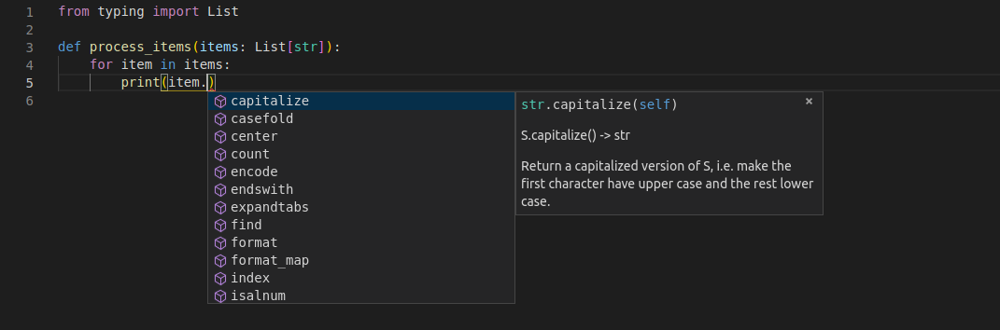
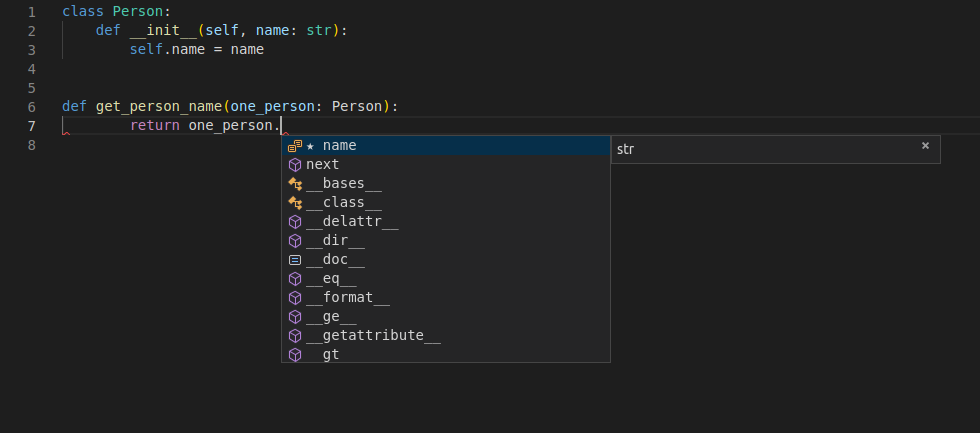

# FastApi——前置知识

> 本文是本人在学习[FastApi官方文档](https://fastapi.tiangolo.com/tutorial/)时的笔记, 其实说是笔记, 也只是本人将文档部分的内容进行了翻译而已.

## Python的类型提示

众所周知, Python是一种弱类型的语言, 我们不需要在生命变量的时候指定变量的类型. 这让Python变得更加易上手且精简, 但是也让Python变得没那么“严谨”, 同时结合Python逐行解释执行的特点, 这导致我们在写程序的一些浅显的类型bug只能在运行时被检测到, 这对大型的项目来说无疑是非常致命的.

此外, 如果我们不通过某种方法来制定Python变量的数据类型, 那么我们就近乎于放弃了现代IDE的代码补全功能, 因为IDE很难通过我们的Python代码直接解析出变量的类型, 也就无法给你提示变量有哪些附属方法了.

处于以上原因, Python从3.5版本开始为Python提供了可选的类型声明, 这为用户使用IDE的代码补全功能提供了便利, 也让Python编写的代码有了更高的严谨性.

### 声明类型

#### 简单类型

我们可以声明所有的Python中的标准类型:

- int
- float
- bool
- bytes

像下面这样:

```python
def get_items(item_a: str, item_b: int, item_c: float, item_d: bool, item_e: bytes):
    return item_a, item_b, item_c, item_d, item_d, item_e
```

#### 带有类型参数的泛型类型

在Python有一些数据结构能够包含其他的值, 比如`dict`、`list`、`set`和`tuple`. 并且这些内部的值也有他们各自的类型.

这些带有内部类型的类型被称为“泛型”. 并且他们可以被声明, 甚至他们的内部的类型也可以被声明.

为了声明这些类型和他们的内部类型, 你能够调用Python的内置模块`typing`. 他是专门用来支持这些类型提示的.

> 值得注意的是`typing`并不是在所有版本中都可用的, 首先虽然, 类型提示是在`3.5`版本加入的, 但是你需要在`3.6+`的版本才可以正常的使用他们(我猜是第一版不太好用吧😆). 此外, 在`3.9+`版本的情况下, 你甚至不需要单独的`import typing`, 因为他已经太常用了, 以至于Python进一步的内置了他.

##### List

一个典型的例子就是List类型, 我们可以如下声明一个字符串类型的数组作为函数的参数:

```python
def process_items(items: list[str]):
    for item in items:
        print(item)
```

> 方括号中的类型被称为“类型参数”
>
> 这个例子中, `str`被作为参数传递给`list`
>
> 这里需要注意的是, 本文假定了我们在使用`3.9+`版本的Python, 或者更确切的说, 我们是在使用`3.10`版本的Python. 由于版本的迭代, 之前的版本的实现方式会有一些不同.(比如在`3.8-`版本下, 此时在声明参数时需要写做: `List[str]`, 是的没错, 他大写了)

以上的例子说明了, `items`变量是一个`list`类型的对象, 并且它内部每一个元素都是`str`.

经过以上的简单提示, 你就可以在你常用的IDE中获取代码补全提示了:



##### Tuple and Set

你可以以同样的方式声明一个`tuple`或者`set`

```python
def process_items(items_t: tuple[int, int, str], items_s: set[bytes]):
    return items_t, items_s
```

以上代码表示:

- 变量`item_t`是一个`tuple`类型的对象, 并且其内部有且只有三个元素. 期中, 第一个元素为`int`, 第二个元素为`int`, 第三个元素为`str`
- 变量`item_s`是一个`set`类型的对象, 并且它内部的每一个元素都是`bytes`

##### Dict

为了定义一个`dict`, 你需要传入两个类型参数, 并且通过`,`分割他们

其中第一个类型参数代表了`dict`中`key`的类型

第二个类型参数代表了`dict`中`value`的类型

```python
def process_items(prices: dict[str, float]):
    for item_name, item_price in prices.items():
        print(item_name)
        print(item_price)
```

##### Union

你可以指定一个变量为几个限定类型中的任意一个, 比如, 这个变量为`int`或`str`

在`3.10+`版本的Python中, 你可通过`|`来实现这个效果, 如下:

```python
def process_item(item: int | str):
    print(item)
```

这意味着, `item`这个元素是`int`类型或者`str`类型.

> 注意, `|`这个语法是`3.10`版本引入的, 更加通用的写法是`Union[int, str]`, 是的是通过`Union[...]`来达到效果的

##### 可能的None值

你可以一个变量, 他可以是你制定的类型的实例, 也可以是一个`None`

在`3.9-`版本中, 你可通过`Something| None`来达到以上效果:

```python
def say_hi(name: str | None = None):
    if name is not None:
        print(f"Hey {name}!")
    else:
        print("Hello World")
```

相应的更通用的写法如下:

```python
from typing import Optional

def say_hi(name: Optional[str] = None):
    if name is not None:
        print(f"Hey {name}!")
    else:
        print("Hello World")
```

此外, 在看过了`Union`之后, 你或许还能想到另一种写法:

```python
from typing import Union

def say_hi(name: Union[str, None] = None):
    if name is not None:
        print(f"Hey {name}!")
    else:
        print("Hello World")
```

实际上, 这三种写法本质上是相同的, `Option[...]`是`Union[..., None]`的简写, 而`... | None`也是`Union[..., None]`的语法糖

##### 使用Union还是Optional

如果你是`3.10+`版本的用户, `FastApi`作者给出的建议是:

- 避免使用`Optional[...]`
- 使用`Union[..., None]`来代替他

虽然这两种写法是等价的, 但是作者仍然推荐`Union`而不是`Optional`, 因为`Optional`暗含了这个参数是可选的这一含义, 而`Union[..., None]`的含义更加清晰.

不过, 如果你在使用`3.10+`版本的Python的话, 你无需忧虑这些问题, 直接使用`|`就好

##### 通用类型

希望你没有忘记, 通用类型是指`list`这样的, 内部元素可以有自己的类型的类型. 他们有:

- list
- tuple
- dict
- dict

> 注意以上通用类型在使用时, 如果你在使用`3.9-`版本的Python ,请首字母大写

- Union
- Optional
- ...

##### 类作为变量的类型

你能够使用一个自定义的类作为一个变量的类型, 比如:

```python
class Person:
    def __init__(self, name: str):
        self.name = name

def get_person_name(one_person: Person):
    return one_person.name
```

这样, 你也可以享受现代IDE带来的便捷:



> 特别强调一下, 以上的代码意味着`one_person`变量是一个`Person`的实例, 而不是`Person`类型本身

#### Pydantic模型

`Pydantic`是一个用来执行数据校验的Python库

你将数据的形状“shape”声明为带有属性的类, 并且每一个属性都有一个类型

然后, 你通过一些值来创建了一个这个类的实例, 此时`Pydantic`会检验这些值, 并且尝试将它们转化为合适的类型, 最后返回给你一个包含所有数据的对象.

一下是一个例子:

```python
from datetime import datetime
from pydantic import BaseModel

class User(BaseModel):
    id: int
    name: str = "John Doe"
    signup_ts: datetime | None = None
    friends: list[int] = []

external_data = {
    "id": "123",
    "signup_ts": "2017-06-01 12:22",
    "friends": [1, "2", b"3"],
}
user = User(**external_data)
print(user)
# > User id=123 name='John Doe' signup_ts=datetime.datetime(2017, 6, 1, 12, 22) friends=[1, 2, 3]
print(user.id)
# > 123
```

> FastApi是基于`Pydantic`的

### 带有元数据注释的类型提示

Python还有一个特性, 那就是允许使用`Annotated`

在`3.9+`的版本中, `Annotated`是`typing`标准库的一部分, 你可以如下使用它

```python
from typing import Annotated

def say_hello(name: Annotated[str, "this is just metadata"]) -> str:
    return f"Hello {name}"
```

> 虽然, 我们前面说过, `3.9+`版本之后, 我们在使用类型提示的时候不需要单独的`import typing`, 但如果你需要使用`typing`中的别的功能, 你还是需要单独`import typing`的

Python并不会对`Annotated`做任何事, 对于编辑器和其他的工具来说, `name`的类型仍然是`str`.

> 听上去似乎`Annotated`没什么用

但是你能够通过`Annotated`来为FastApi提供元数据, 来声明你希望你的application要如何行动

值得注意的是, 你传给`Annotated`的第一个参数是`name`的实际类型, 而其他的部分都是给其他工具的元数据.

如果你知道元数据是什么, 你自然能意识到`Annotated`的作用, 但是如果你并不知道, 先记住有这么个东西, 之后你会见识的他的强大的.

### FastApi中的类型提示

在FastApi中, 我们利用类型提示完成了几件事

使用FastApi你可以声明参数的类型类型, 然后你就可以:

- 得到IDE的支持
- 类型检查

并且FastApi还会基于声明来完成:

- **定义需求**：从请求路径参数、查询参数、标头、主体、依赖项等。
- **转换数据**：从请求到所需的类型。
- **验证数据**: 来自每个请求：
  - 当数据无效时生成**自动返回给客户端的错误。**
- 使用 OpenAPI记录API：
  - 然后由自动交互式文档用户界面使用。

## 并发和async/await

这部分内容, 我们会介绍一些有关路径操作函数的 async def 语法的详细信息以及有关异步代码、并发性和并行性的一些背景知识。

现代版本的Python支持你通过“异步代码”来使用“协程”(`coroutines`), 或者说通过`async`和`await`语法.

让我们通过如下几部分内容来了解这个语法:

- 异步代码
- `async`和`await`
- 协程 `coroutines`

### 异步代码

异步代码仅仅意味着语言能够通过某种方式来告诉program, 在某个时刻, program需要等待一些事情在其他地方完成. 我们暂且管这个“一些事情”叫做“慢文件”.

所以, 在这段时间里, 计算机可以去做一些别的工作, 等待慢文件的完成

然后, 计算机将会在任何可能的时候回来, 比如计算机再次进入等待状态或者计算机完成了当时的所有工作. 并且计算机会查看等待的任何任务是否已经完成, 并且执行它必须执行的操作.

接下来, 计算机会完成第一个任务(慢文件), 并且继续与他有关的任何事

“一些事情”通常是指相对”慢“的一些IO操作, 比如:

- 来自客户端的数据通过网络发送
- 您的程序发送的数据，客户端通过网络接收
- 磁盘中文件的内容由系统读取并提供给您的程序
- 您的程序提供给系统以写入磁盘的内容
- 远程API操作
- 要完成的数据库操作
- 数据库查询返回结果
- ETC

因为执行这些任务的时间大部分都在等待IO操作, 所以他们被称为IO绑定操作

之所以称之为“异步”, 这是因为计算机/程序不必与慢速任务“同步”执行(等待慢速任务完成, 同时什么也不做), 来获取任务结果并继续工作

相反, 通过一个“异步”系统, 任务可以稍微等待计算机/程序完成它要做的事, 然后获取结果并继续工作.

对于“同步”, 他们通常使用一个属于“顺序”, 因为计算机/程序在切换到不同任务之前按顺序遵守所有步骤, 即使这些任务涉及等待.

#### 并发汉堡

现在你和你喜欢的人一起去买快餐, 首先你们要排队. 收银员从你的前面那个人那里接受订单:


现在轮到你了, 你为你和你的暗恋对象买了两个美味的汉堡.


然后收银员告诉了厨房中的厨师一些信息, 然后厨师知道了要为你准备两个美味汉堡.


你付钱之后, 收银员给你了一个号码牌


在你等待的时候, 你拿着你的号码牌, 并且挑了一张桌子.

在你和你喜欢的人坐在餐桌边上等待汉堡做好的时候, 你可以花时间欣赏你喜欢的人是多么的好看、有趣和聪明✨😍✨.

> 这个emoji是直接copy自官方文档的.😆


当你等待并且和你喜欢的人交谈时, 你时不时的会查看柜台上显示的号码, 看看是否轮到你了.

然后, 在某个时刻, 终于轮到你了. 你走到柜台, 拿了汉堡, 然后回到了你的餐桌.


然后, 你和你喜欢的人一次吃着汉堡, 度过了一段愉快的时光


想想一下, 你是故事中的一个计算机/程序

当你在排队时, 你只是在闲着, 等着轮到你, 没有做任何“高效”的事情. 但是排队速度很快, 因为收银员只是接受订单(不生产订单)

然后, 当轮到你的时候, 你要做实际的“生产性”工作: 你处理菜单, 决定你想要什么, 采纳你喜欢的人的建议, 付钱, 检查你是否提供了正确的账单和卡片, 检查你的收费是否正确, 检查订单中的商品是否正确等.

但是之后, 你从柜台走开, 拿着你的号码牌坐在餐桌旁. 能够转移你的注意力到你喜欢的人身上, 并且继续“work”. 然后你再次可以做一些“生产性”工作, 比如和你喜欢的人聊天.

> 毕竟, 你此行的核心目的肯定是加深你和她的感情对吧. 肯定不是只为了吃饭吧? 不会吧? 不会吧?

然后, 收银员说“我已经完成了汉堡”, 然后把你的号码显示在前台上. 你听到时候, 并不会立刻跳起来冲到前台, 因为你知道没人会偷走你的汉堡, 因为他们有自己的号码, 有自己汉堡. 

于是, 等你和喜欢的人结束了当前话题后, 你才会站起来去拿汉堡.

然后你去柜台，到现在已经完成的初始任务，挑选汉堡，说声谢谢，然后把它们带到餐桌上。这就完成了与计数器交互的步骤/任务。这反过来又创建了一个新任务“吃汉堡”，但前一个“获取汉堡”已经完成了。

#### 并行汉堡

现在我们在设想一种情况.

你和你喜欢的人一起去吃并行汉堡.

你排队时, 几个(假设是8个)同时担任厨师的收银员正在接收你前面的人的订单.

在你离开柜台之前, 每个人都在等待汉堡准备好, 因为8个收银员都会在准备好当前订单的汉堡之后才接收下一个订单.


然后又轮到你了, 你为你和你喜欢的人点了两个美味汉堡, 然后付钱


然后收银员冲进了厨房.

然后你站在柜台前开始等待, 以确保不会有人拿走你的汉堡(毕竟, 你们现在没有号码牌了)


由于您和您的暗恋对象都忙于不让任何人挡在您前面并在他们到达时拿走您的汉堡，因此您无法关注您的暗恋对象。

这是“同步”的工作，你与收银员/厨师“同步”。你必须等待并在收银员/厨师吃完汉堡并将其交给你的那一刻到达那里，否则其他人可能会拿走它们。


然后，您的收银员/厨师在柜台前等待了很长时间后，终于带着您的汉堡回来了。


你拿着汉堡，和你喜欢的人一起走到餐桌旁。

你只要吃掉它们，就完成了。


显然, 你和你喜欢的人并没有多少时间来加深感情了.

在这个并行汉堡的场景中, 你也是一台计算机/程序, 有两个处理器(你和你的暗恋对象), 两者都在等待并专注于等待汉堡的制作, 并等待了很长一段时间

快餐店有8个员工, 快餐店有 8 名加工人员（收银员/厨师）。而并发营业的汉堡店可能只有 2 名（一名收银员和一名厨师）。

但最终的体验仍然不是最好的。

#### 汉堡结论

在这种“和你喜欢的人一起吃快餐汉堡”的场景中，由于等待时间很长，所以拥有一个并发系统更有意义

大多数 Web 应用程序都是这种情况。

很多很多用户，但您的服务器正在等待他们的不太好的连接来发送他们的请求。

然后再次等待回复回来。

这种“等待”以微秒为单位，但总而言之，最终还是需要等待很多时间。

这就是为什么为 Web API 使用异步代码非常有意义。

这种异步性使得 NodeJS 流行起来（尽管 NodeJS 不是并行的），这也是 Go 作为编程语言的优势。

**这与使用FastAPI**获得的性能水平相同。

由于可以同时具有并行性和异步性，因此您可以获得比大多数经过测试的 NodeJS 框架更高的性能，并且与 Go 相当，Go 是一种更接近 C 的编译语言

#### 并发比并行好吗?

不是的! 这个故事并不是这个意思

并发与并行并不相同. 并且并发在涉及许多等待的场景中表现的更好. 因此，对于 Web 应用程序开发来说，它通常比并行性要好得多。但并不适用于一切

#### 并发+并行: Web+机器学习

使用**FastAPI，**您可以利用 Web 开发中非常常见的并发性（这也是 NodeJS 的主要吸引力）。

但是，您还可以利用并行性和多处理（并行运行多个进程）的优势来处理**CPU 密集型**工作负载，例如机器学习系统中的工作负载。

再加上 Python 是**数据科学**、机器学习，尤其是深度学习的主要语言这一简单事实，使得 FastAPI 非常适合数据科学/机器学习 Web API 和应用程序（以及其他许多应用程序）。

> 如何在生产中实现这种并行性, 请参阅有关部署的[部分](https://fastapi.tiangolo.com/deployment/)

### `async`和`await`

现代版本的Python使用一种非常直观的方式来定义异步代码. 着使得他看起来就跟“顺序”代码一样, 并且它会在正确的时刻为你进行“awaiting”

当一个操作将会需要进行等待, 并且他已经支持了这些Python的新特性, 你能够如下操作:

```python
burgers = await get_burgers(2)
```

关键是`await`. 他告诉Python, 他必须要等待`get_burgers(2)`来完成它手头的工作, 才能将结果写入到burgers变量中. 并且, Python也会知道, 它能够同时继续执行并且做一些其他的工作(比如接受另一个请求)

为了让`await`起作用, 它必须位于一个支持异步语法的函数中. 为了让一个函数支持异步语法, 你可以通过`async def`来声明他:

```python
async def get_burgers(number: int):
  # Do some asynchronous stuff to create the burgers
  return burgers
```

而不是`def`

```python
# This is not asynchronous
def get_sequential_burgers(number: int):
    # Do some sequential stuff to create the burgers
    return burgers
```

借助`async def`, Python知道了在函数的内部, 它必须要注意`await`表达式, 并且它能够暂停这个函数的执行, 并且在他完成并返回之前执行别的任务.

当你要用调用`async def`函数时, 你必须要配套使用`await`, 否则他不会起作用(或者说不会异步):

```python
# This won't work, because get_burgers was defined with: async def
burgers = get_burgers(2)
```

所以, 如果你使用的库告诉你它能够伴随着`await`来使用它, 你就需要在定义路径操作函数时使用`async def`, 就像:

```python
@app.get('/burgers')
async def read_burgers():
    burgers = await get_burgers(2)
    return burgers
```

#### 更多的技术细节

你可能注意到了`await`只能够被用在`async def`定义的函数内部.

但是同时, `async def`定义的函数必须要借助`await`调用. 

所以, 是鸡生蛋呢?还是蛋生鸡呢?

如果你在使用FastApi, 你不必考虑这个问题, 因为"The First"是你的路径操作函数, 并且FastApi知道如何做争取的事情.

但是如果你想要在不使用FastApi的情况下使用`async`/`await`, 那你就需要注意个问题了.

### 协程(Coroutines)

协程是一个蛮奇特的术语, 指的是`async def`函数. Python知道它就像一个函数, 他可以启动, 也会在某个时刻停止, 但是只要它内部有`await`, 那么它也可能在内部暂停.

但是, 将异步代码与`async`和`await`很多时候被合称为协程. 他能够和GO的“协程”特性相媲美

