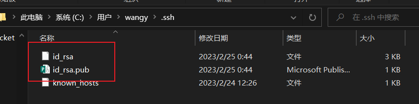
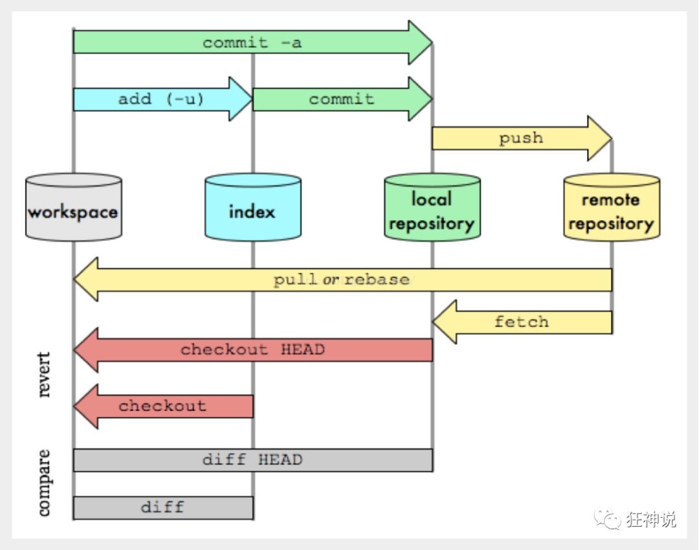

# Git快速上手

Windows端在安装git后再git bash下操作

macos和linux端直接在终端下操作即可

# 码云等仓库配置ssh公钥

1. 生成本机SSH公钥，方便登录连接仓库

```shell
ssh-keygen -t rsa
```

2. 生成后在当前系统用户目录的.ssh文件夹下会生成两个文件:



3. 添加生成的公钥（`id_rsa.pub`中的内容）到账户中

# Git配置

## 查看

- 查看当前仓库下的所有Git配置（系统配置+本地配置）

```Shell
git config -l
```

- 查看系统配置

```Shell
git config --system --list
```

- 查看本地配置

```Shell
git config --global --list
```

> 系统配置：整个Git的全局生效的配置
>
> 全局配置：当前系统用户的配置（windows用户，Linux用户）
>
> 二者有冲突时生效全局配置

## 配置

### 文件形式

所有配置都存储在对应文件里，可直接修改相应配置文件配置git

- 系统配置：git安装目录下的**gitconfig**
  -  Windows: `.../Git/mingw64/etc/gitconfig`

  -  Macos/Linux: `/etc/gitconfig`
- 全局配置：当前登录用户的用户目录下的**.gitconfig**
  -  Windows: `C:/Users/username/.gitconfig`

  -  Macos/Linux: `/home/username/.gitconfig`

### 命令行形式

以修改用户名和密码为例

```Shell
git config --global username "wangyan"
git config --global user.email "1498@qq.com"
```

用户名和密码的配置是必须配置的

# Git基本逻辑


- Working Directory：工作区，项目文件夹
- Index/Stage：暂存区，用于临时存放改动。实际上只是接著一个文件，保存即将提交到文件列表的信息
- Repository：仓库区（或本地仓库），就是安全存放数据的未知，这里有提交到所有版本的数据，其中Head指向最新存入仓库的版本
- Remote：远程仓库，托管代码的服务器




Remote和Repository仓库中代码不一致时可能会无法push

# 仓库管理

## 仓库初始化

### 创建本地仓库

创建一个全新的本地仓库，只需在目标项目文件夹下执行如下操作

```Shell
git init
```

### 克隆远程仓库

在预想的父文件夹下执行如下操作

```shell
git clone [url]
```

# Git的文件操作

## Git逻辑下文件的状态

- Untracked：未跟踪，此文件在文件夹中，但没有加入到Git仓库，不参与版本控制

  可通过`git add`将其更改为Staged状态-

- Unmodify：文件已经入库，未修改，即版本库中的文件快照与当前文件夹中完全一致

  如果接下来文件被修改，则变为Modified状态。如果使用`git rm`命令，则可将文件变为Untracked，即移除版本库

- Modified：文件已修改，仅仅是修改，并没有其他操作

  此时文件可以进行两种操作：

  1. `git add`：将文件加入暂存区	->Stage状态
  2. `git checkout`：废弃修改，回复文件	->Unmodify状态

- Staged：暂存状态

  此时执行``git commit`可将其同步到本地代码库	->Unmodified状态

  此时执行`git reset HEAD filename` 则取消暂存（根据仓库初始化暂存区）	->Modified状态

 文件状态可通过在项目文件夹下执行命令`git status`来查看

# Git分支操作


## Git常用操作

```shell
# 列出所有本地分支
git branch

# 列出所有远程分支
git branch -r

# 新建一个分支，但依然停留在当前分支
git branch [branch-name]

# 新建一个分支，并切换到该分支
git checkout -b [branch]

# 切换分支
git checkout [branch]

# 合并指定分支到当前分支
git merge [branch]

# 删除分支
git branch -d [branch-name]

# 删除远程分支
git push origin --delete [branch-name]
git branch -dr [remote/branch]

# 拉取远程仓库中的目标分支与本地的指定分支合并
git pull <远程主机名> <远程分支名>:<本地分支名>
# <远程主机名> 是指需要合并的目标分支的仓库地址，一般用origin代替
# <远程分支名> 是指需要合并的目标分支的名字，如master分支
# <本地分支名> 是指被合并的分支，如dev分支
```
