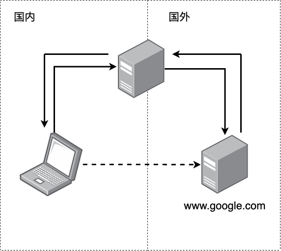
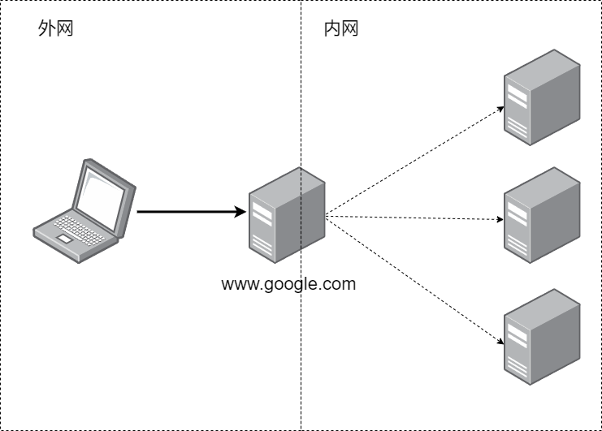

# Nginx介绍

>文章思路：
>
>1. 介绍Nginx
>2. 逐个解释Nginx的核心概念
>3. 列出Nginx的常用命令

Nginx联合创始人安德鲁·阿列克谢夫（Andrew Alexeev）曾说：Nginx是为对Apache性能不满意的人而构建的。随着Internet需求的变化，Web服务器的工作也在变化。Nginx的构建比以往任何时候都更有效率，更可扩展，更安全，更强大。

Nginx同Apache一样都是一种Web服务器。基于REST架构风格， 以统一资源描述符（Uniform Resources Identifier）URI或者统一资源定位符（Uniform Resources Locator）URL作为沟通依据， 通过HTTP协议提供各种网络服务。

Apache 的发展时期很长，而且是毫无争议的世界第一大服务器。它有着很多优点：稳定、开源、跨平台等等。

它出现的时间太长了，它兴起的年代，互联网产业远远比不上现在。所以它被设计为一个重量级的。它不支持高并发的服务器。在 Apache 上运行数以万计的并发访问，会导致服务器消耗大量内存。操作系统对其进行进程或线程间的切换也消耗了大量的 CPU 资源，导致 HTTP 请求的平均响应速度降低。

这些都决定了 Apache 不可能成为高性能 Web 服务器，轻量级高并发服务器 Nginx 就应运而生了。

##  Nginx的优势

- Nginx 使用基于事件驱动架构，使得其可以支持数以百万级别的 TCP 连接。
- 高度的模块化和自由软件许可证使得第三方模块层出不穷（这是个开源的时代啊）。
- Nginx 是一个跨平台服务器，可以运行在 Linux、Windows、FreeBSD、Solaris、AIX、Mac OS 等操作系统上。
- 这些优秀的设计带来的极大的稳定性。

## Nginx核心概念

- 反向代理
- 负载均衡
- 动静分离

## 反向代理

理解Nginx的特性首先要了解反向代理.

### 代理

**代理**就是在服务器和客户端之间架设一层服务器，代理将会接收客户端的请求并将它转发给服务器，然后将服务器的响应转发给客户端。

不管正向代理还是反向代理，本质上都是实现以上的“代理”功能。

### 正向代理

**正向代理**（forward）意思是一个位于客户端和原始服务器（origin server）之间的服务器。由于客户端出于某种原因不能直接和原始服务器通讯，所以客户端会向代理服务器发送请求，并指定目标服务器，然后由代理向原始服务器转交请求并将获得的内容返回给客户端。

此时“代理”是为客户端进行提供服务的，客户端明确的知道自己希望访问的服务地址，但是自己无法直接访问，因此借助代理实现访问。



翻墙就是一个常见的正向代理技术. 由于防火墙设置, 所以我们没有办法直接访问谷歌服务器,  这个时候我们就可以借助代理服务器.

要强调的一点是正向代理对于目标服务器是非透明的，即目标服务器只知道这个服务请求是来自代理服务器的，而对客户端一无所知。

> 就像我们翻墙之后访问bilibili，bilibili就会认为我们是海外用户

### 反向代理

**反向代理**（Reverse Proxy）方式是指以代理服务器来接受internet上的请求，然后将请求转发给内部网络上的服务器，并将从服务器上得到的结果返回给internet上请求链接的客户端，此时代理服务器对外就表现为一个反向代理。

此时“代理”是为目标服务器提供的，客户端此时并不知道实际上自己在请求哪个服务器的服务，他只知道自己在请求代理服务器。



我们再来看一个例子，我们在使用google搜索感兴趣内容时，google需要进行运算，来根据我们给出的关键词搜索内容并强化我们的用户画像，显然，每时每刻都会有大量的类似请求发生。此时，由于硬件的限制，我们无法通过一台服务器就满足算力需求，因此我们会想到：能不能把这些请求均摊给若干个服务器，由这些服务器共同承担计算任务？如果可以的话，要怎么实现呢？

这当然是可以的，而Nginx就可以实现这个设计。

相较于正向代理，反向代理对于客户端是非透明的，即客户端并不知道自己实际上是在请求哪个内网中的服务器的服务。

> 虽然google一定是通过服务器集群来实现的自身服务的，但是我们仍然可以直接把他当做一台服务器来请求，实际上我们就是在请求google的反向代理服务器

### 实现反向代理

Nginx实现反向代理很简单，我们通过以下的例子进行简单的解释：

```yaml
server {
    listen       80;
    server_name  192.168.17.129;

    location / {
        root   html;
        index  index.html index.htm;
    }
    location ~ /edu/ {
    	proxy_pass  http://127.0.0.1:8080
    }

    location ~ /vod/ {
    	proxy_pass  http://127.0.0.1:8081
    }
}
```

- 我们通过Nginx部署静态页面，当用户请求是根目录时，我们直接发送静态页面资源
- 我们通过反向代理为`edu`下的请求转发到8080端口
- 我们通过反向代理为`vod`下的请求转发到8081端口

## 负载均衡

我们来简单聊聊Nginx实现反向代理中的重要概念——负载均衡。

如果请求数过大，单个服务器解决不了，我们会增加服务器数量，然后讲请求分发到各个服务器上，讲原来请求集中单个服务器的情况改为分发到多个服务器上，这就是**负载均衡**。

### 简单的实现

Nginx实现基础的负载均衡很简单，我们可以在配置文件中通过`Upstream`指定后端服务器地址列表，在server中拦截响应请求，并将请求转发到`Upstream`中配置的服务器列表：

```yaml
upstream balanceServer {
    server 10.1.22.33:12345;
    server 10.1.22.34:12345;
    server 10.1.22.35:12345;
}

server { 
    server_name  fe.server.com;
    listen 80;
    location /api {
        proxy_pass http://balanceServer;
  }
```

我们为后端服务器集合命名为`balanceServer`，当用户请求在路径`http://fe.server.com/api/`下的服务时，Nginx会将请求分发到后端服务器集合上。

### 调度算法

看了以上的简单实现之后，我们就会自然产生一个疑问，Nginx是如何讲请求分发到后端服务器上的呢？总不能是随机分发吧？

> 这部分可以适当联系操作系统相关的进程调度算法

Nginx自然是有调度算法在其中的，在此我们介绍两种最常见的调度算法：

- **weight轮询**（默认算法）：接收到的请求按照权重分配到不同的后端服务器，即使在使用过程中，某一台后端服务器宕机，Nginx会自动将该服务器剔除出队列，请求受理情况不会受到任何影响。这种方式下，可以给不同的后端服务器设置一个权重值(weight)，用于调整不同的服务器上请求的分配率；权重数据越大，被分配到请求的几率越大；该权重值，主要是针对实际工作环境中不同的后端服务器硬件配置进行调整的。ip_hash（常用）：每个请求按照发起客户端的ip的hash结果进行匹配，这样的算法下一个固定ip地址的客户端总会访问到同一个后端服务器，这也在一定程度上解决了集群部署环境下session共享的问题。
- **fair**：智能调整调度算法，动态的根据后端服务器的请求处理到响应的时间进行均衡分配，响应时间短处理效率高的服务器分配到请求的概率高，响应时间长处理效率低的服务器分配到的请求少；结合了前两者的优点的一种调度算法。但是需要注意的是Nginx默认不支持fair算法，如果要使用这种调度算法，请安装`upstream_fair`模块。`url_hash`：按照访问的url的hash结果分配请求，每个请求的url会指向后端固定的某个服务器，可以在Nginx作为静态服务器的情况下提高缓存效率。同样要注意Nginx默认不支持这种调度算法，要使用的话需要安装Nginx的hash软件包。

## 动静分离

我们已经介绍了Nginx重要的反向代理和负载均衡的概念和简单实现，现在我们再来了解一下动静分离这个概念。

我们可以简单的讲网络请求分成两种：

- 资源型请求： 请求服务器上的静态资源，比如html、css、js和图片等。
- 计算型请求：请求服务器提供服务，服务器需要进行计算，并将计算结果返回给用户

此时就出现了一种符合直觉的想法：为了加快服务器解析速度，把静态资源和后端服务分开放置，分别由专门的服务器来解析，进而加快解析速度。

显然，我们可以通过Nginx的反向代理功能实现动静分离，但是我们之所以还要强调Nginx的动静分离概念，是因为Nginx同时还是一个强大的静态资源服务器，即Nginx完全可以承担`动静分离`中的`静`这部分。

## Nginx常用命令

```bash

# 快速关闭Nginx，可能不保存相关信息，并迅速终止web服务
nginx -s stop
# 平稳关闭Nginx，保存相关信息，有安排的结束web服务
nginx -s quit
# 因改变了Nginx相关配置，需要重新加载配置而重载
nginx -s reload
# 重新打开日志文件
nginx -s reopen
# 为 Nginx 指定一个配置文件，来代替缺省的
nginx -c filename
# 不运行，而仅仅测试配置文件。nginx 将检查配置文件的语法的正确性，并尝试打开配置文件中所引用到的文件
nginx -t
#  显示 nginx 的版本
nginx -v
# 显示 nginx 的版本，编译器版本和配置参数
nginx -V
# 格式换显示 nginx 配置参数
2>&1 nginx -V | xargs -n1
2>&1 nginx -V | xargs -n1 | grep lua
```

## 参考资料

1. [Nginx详解，睡前十分钟啃完值了！](https://mp.weixin.qq.com/s/XoqGvYBabW8YBl9xEeNYZw)
2. [8分钟带你深入浅出搞懂Nginx](https://zhuanlan.zhihu.com/p/34943332)
3. [Nginx配置反向代理，一篇搞定！](https://zhuanlan.zhihu.com/p/451825018)
