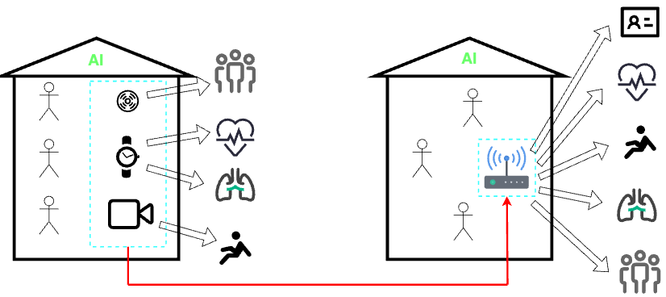
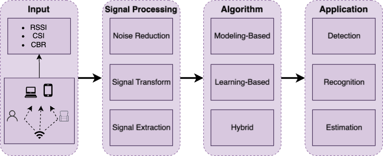
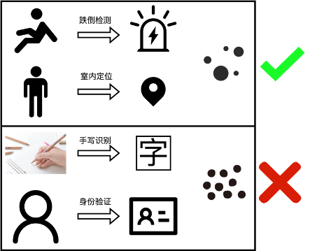
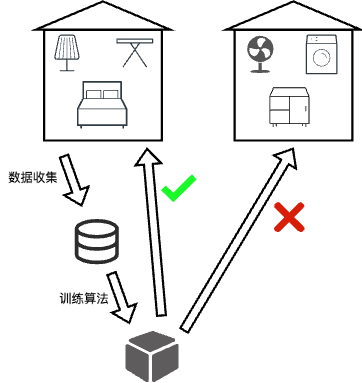

# WiFi Sensing概述

> 源自本人2024年6月5日的一次论文汇报

## 1. 简介

### 什么是WiFi感知？

答：使用WiFi设备感知环境数据，替代原本特定传感器的功能，拓宽感知的边界。

### WiFi感知有什么优点？

- WiFI设备分布广泛，设备基础好
    
- 比起基于图像的感知方案具有更好的安全性和隐私性
    
- 一体化

### WiFi感知的原理

多径效用：OFDM系统中发射信号通过多个子载波在空间中经过多径传播到接收器，形成接收信号。此时接受信号的偏移、衰弱、失真暗含了环境信息。

> Multipath is good.

## 2. 系统范式

## 3. 关键问题

> 关键问题为本人阅读综述文献和一些其他文献之后自己总结的结论，仅供参考。

### 问题1: 如何提高算法精度

- WiFi设备已经被证实能够支撑不同颗粒度的任务
    
- 目前对于粗颗粒度的任务，已经有很多算法能够做到很高的精度
    
- 对于颗粒度较细的任务，比如手写识别、身份验证等，算法的精度还有待提升

### 问题2:如何提升算法泛化性能和鲁棒性？

- 多径效应本身和环境高度相关，因此WiFi感知的环境泛化性能差
    
- 如何提高对未知标签的鲁棒性？

### 问题3:实地部署/共存问题？

- WiFi如何与摄像机和其他传感器共存？
    
- WiFi感知如何与当前通信用WiFi网络共存？
    
- 不同的WiFi感知应用之间如何共存？

### 问题4:安全性

- 如何消除WiFi信号中隐含的环境信息

- 如何消除WiFi信号中特定的环境信息（屏蔽特定应用）

- 如何保留WiFi信号中特定的环境信息（准入特定应用）

## 4. 参考文献

- Boudlal, Hicham, Mohammed Serrhini和Ahmed Tahiri. 《A Comprehensive Review of Wifi Sensing Technologies: Tools, Challenges and Future Research Directions》, 030004. Meknes, Morocco, 2023. https://doi.org/10.1063/5.0148509.
- Hernandez, Steven M., 和Eyuphan Bulut. 《WiFi Sensing on the Edge: Signal Processing Techniques and Challenges for Real-World Systems》. IEEE Communications Surveys & Tutorials 25, 期 1 (2023年): 46–76. https://doi.org/10.1109/COMST.2022.3209144.
- Ma, Yongsen, Gang Zhou和Shuangquan Wang. 《WiFi Sensing with Channel State Information: A Survey》. ACM Computing Surveys 52, 期 3 (2019年6月18日): 46:1-46:36. https://doi.org/10.1145/3310194.
