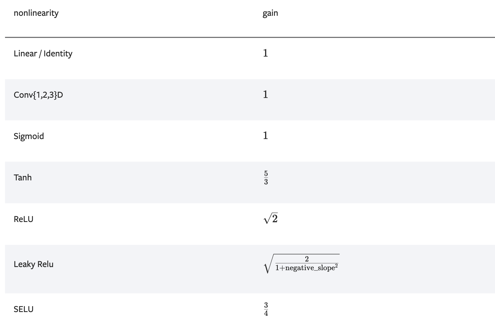

# init

> pytorch的初始化方法

> init中的所有方法都是在初始化网络参数，所以他们都运行在`torch.no_grad()`上下文中，并且不会被纳入自动微分中。

## calculate_gain

`torch.nn.init.calculate_gain`是一个函数，用于获取非线性函数的增益值。

> 关于增益值的概念，可参考:[增益值](/phd/机器学习/初始化/增益值)



demo:

```python
gain = nn.init.calculate_gain('leaky_relu', 0.2)  # leaky_relu with negative_slope=0.2
```

## uniform_

`torch.nn.init.uniform_`用于初始化权重参数为均匀分布。

```python
torch.nn.init.uniform_(tensor, a=0.0, b=1.0, generator=None)
```

> `a`为下届，`b`为上界。

> `generator`是随机数生成器，如果为`None`，则使用默认的随机数生成器。你也可以手动制作一个随机数生成器专门用于此处初始化

demo:

```python
w = torch.empty(3, 5)
# 创建一个生成器实例，并设置一个种子
gen = torch.Generator().manual_seed(42)
nn.init.uniform_(w, generator=gen)
```

## normal_

`torch.nn.init.normal_`用于初始化权重参数为正态分布。

```python
torch.nn.init.normal_(tensor, mean=0.0, std=1.0, generator=None)
```

> mean为均值，std为标准差

demo:

```python
w = torch.empty(3, 5)
nn.init.normal_(w)
```

## constant_

使用指定常数填充tensor

```python
torch.nn.init.constant_(tensor, val)
```

demo:

```python
w = torch.empty(3, 5)
nn.init.constant_(w, 0.3)
```

## ones_

使用1填充tensor

```python
torch.nn.init.ones_(tensor)
```

demo:

```python
w = torch.empty(3, 5)
nn.init.ones_(w)
```

## zeros_

使用0填充tensor


```python
torch.nn.init.zeros_(tensor)
```

demo:

```python
w = torch.empty(3, 5)
nn.init.zeros_(w)
```

## eye_

使用单位矩阵填充tensor

```python
torch.nn.init.eye_(tensor)
```

demo:

```python
w = torch.empty(3, 3)
nn.init.eye_(w)
```

## dirac_

使用Dirac delta函数填充tensor，仅支持维度为3/4/5的tensor

```python
torch.nn.init.dirac_(tensor, groups=1)
```

> `conv`层中的组数

demo:

```python
w = torch.empty(3, 16, 5, 5)
nn.init.dirac_(w)
w = torch.empty(3, 24, 5, 5)
nn.init.dirac_(w, 3)
```

## xavier_uniform_

`torch.nn.init.xavier_uniform_`用于初始化权重参数为Xavier分布。

```python
torch.nn.init.xavier_uniform_(tensor, gain=1.0, generator=None)
```

> gain为增益因子，默认为1.0

demo:

```python
w = torch.empty(3, 5)
nn.init.xavier_uniform_(w, gain=nn.init.calculate_gain('relu'))
```

## xavier_normal_

`torch.nn.init.xavier_normal_`用于初始化权重参数为Xavier分布。

```python
torch.nn.init.xavier_normal_(tensor, gain=1.0, generator=None)
```

> gain为增益因子，默认为1.0

demo:

```python
w = torch.empty(3, 5)
nn.init.xavier_normal_(w)
```

## kaiming_uniform_

`torch.nn.init.kaiming_uniform_`用于初始化权重参数为Kaiming分布。

```python
torch.nn.init.kaiming_uniform_(tensor, a=0, mode='fan_in', nonlinearity='leaky_relu', generator=None)
```


> a为negative_slope，默认为0

> mode为fan_in或fan_out，默认为fan_in

> nonlinearity为激活函数，默认为leaky_relu

demo:

```python
w = torch.empty(3, 5)
nn.init.kaiming_uniform_(w, mode='fan_in', nonlinearity='relu')
```

## kaiming_normal_

`torch.nn.init.kaiming_normal_`用于初始化权重参数为Kaiming分布。

```python
torch.nn.init.kaiming_normal_(tensor, a=0, mode='fan_in', nonlinearity='leaky_relu', generator=None)
```


> a为negative_slope，默认为0

> mode为fan_in或fan_out，默认为fan_in

> nonlinearity为激活函数，默认为leaky_relu

demo:

```python
w = torch.empty(3, 5)
nn.init.kaiming_normal_(w, mode='fan_out', nonlinearity='relu')
```

## trunc_normal_

`torch.nn.init.trunc_normal_`用于初始化权重参数为截断正态分布。

```python
torch.nn.init.trunc_normal_(tensor, mean=0.0, std=1.0, a=-2.0, b=2.0, generator=None)
```

> mean为均值，std为标准差

> a为下界，b为上界

demo:

```python
w = torch.empty(3, 5)
nn.init.trunc_normal_(w)
```

## orthogonal_

`torch.nn.init.orthogonal_`用（半）正交矩阵填充输入 Tensor

```python
torch.nn.init.orthogonal_(tensor, gain=1, generator=None)
```

demo:

```python
w = torch.empty(3, 5)
nn.init.orthogonal_(w)
```

## sparse_

`torch.nn.init.sparse_`将 2D 输入 Tensor 填充为稀疏矩阵

稀疏矩阵中的非零元素通过均值为0，方差为`std`的正太分布随机生成。

```python
torch.nn.init.sparse_(tensor, sparsity, std=0.01, generator=None)
```

demo:

```python
w = torch.empty(3, 5)
nn.init.sparse_(w, sparsity=0.1)
```