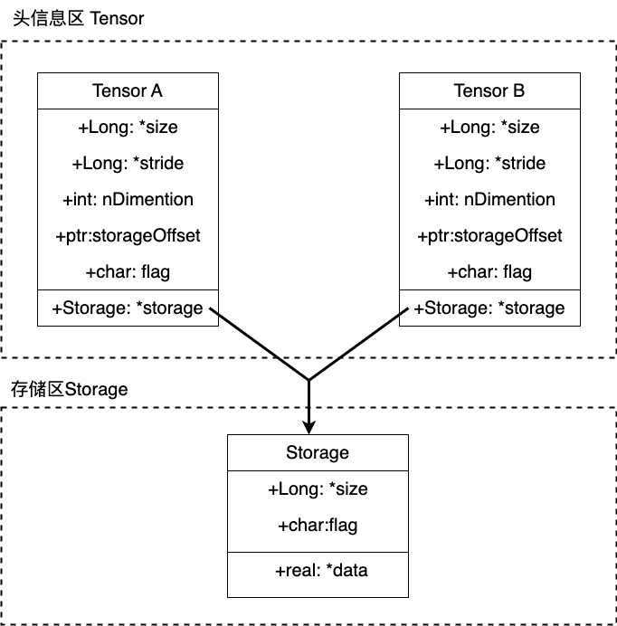
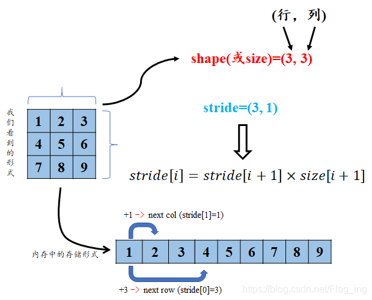
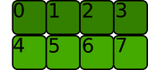
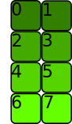
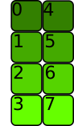
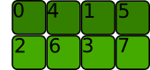

# view()与reshape()的比较和分析

`view`和`reshape`似乎都可以基于已存在的张量, 生成一个数据相同而形状不同的新张量. 从效果上说, 似乎二者是等价的, 但是既然PyTorch选择将他们分做两个函数, 那么二者一定是有一定差异的, 并且可能在某些时候我们要根据实际情况和这些差异选择`view`或者`reshape`其中一个, 而不是看心情.

## 如果只关注于用法

如果我们只关注使用, 那么阅读官方文档就能够满足我们的需求.

### view()

```python
Tensor.view(*shape) => Tensor
```

返回一个和`self`的数据相同但是形状不同的新张量.

返回的张量与`self`共享数据, 并且必须有相同的元素数量. 对一个张量执行`view()`函数, 新视图必须与原始张量的`size`和`stride`兼容, 换句话说就是原始张量和新视图都必须满足`contiguous`(似乎可以被翻译为"连续性"), 或者说满足如下公式:

$$
stride[i] = stride[i+1] \times size[i+1]
$$

否则,函数在此处就会抛出错误.

> 一个张量的`stride`可以通过`Tensor.stride()`函数获取
> 一个张量的`size`可以通过`Tensor.size()`函数或者`Tensor.shape`属性获取

> 这里的`contiguous`或者说"连续性"你可能并不理解, 这是一个涉及到数据底层存储逻辑的概念. 如果你只关注使用, 那么其实你不需要知道满足`contiguous`到底是什么意思, 可以简单的认为满足`contiguous`就是满足以上的公式; 如果你想进一步了解, 请参阅本文档的[如果想深入了解](#如果想深入了解)部分

以上是对[官方文档](https://pytorch.org/docs/stable/generated/torch.Tensor.view.html?highlight=view#torch.Tensor.view)的摘抄和翻译.

需要注意的是, `view`函数返回的新张量又被叫做视图, 它可以被当作一个张量使用, 但是这个视图和原始张量是共享数据的(有点类似于C++中的引用), 这意味着:

- 二者共享一个内容空间, 能够节省内存空间
- 你对其中一方的修改, 在另一方上也会生效

此外要说的一点是, 在`reshape()`和`view()`的过程中, 不同形状的新张量(或者说视图)和原张量中的元素遵循如下关系: 按照行优先原则, 原张量的第`k`个元素和新张量的第`k`个元素对应. 我将这个关系称为<mark>行优先拉伸对应关系</mark>.

> 真是只是我本人的一个说法, 没有任何来源
> 这个关系很重要, 某种程度上决定了`view()`和`reshape()`的差异, 之后在解释`contiguous`时也会用到

> 比如对于$2\times 2$规模的张量, `s[0][1]`就是第二个元素($0\times 2 + 2$), `s[1][1]`是第四个元素$1 \times 2 + 2$

### view()带来了一个问题

根据`view()`函数的说明, 我们肯定会产生一个疑问: 如果我们手头有了一个不满足`contiguous`的张量, 而我们又希望根据它的数据得到一个不同形状的新张量, 我们应该怎么做呢?

一个符合直觉的思路是, 既然这个张量不满足`contiguous`, 那我们让它满足`contiguous`不就可以了吗?

是的, 这是一个标准的解法:

```python
# 如果x是一个不满足`contiguous`的张量
y = x.contiguous()
z = y.view(2,3)
# 如此我们就得到了想要的不同形状的新张量: z
```

这里我们调用`Tensor.contiguous()`函数得到了一个和张量`x`具有相同数据且满足`contiguous`的张量`y`, 而后我们再在`y`的基础上通过`view()`函数成功得到了我们需要的新张量(或者说视图).

但是值得注意的是, 此处`y`是一个全新的张量, 它和`x`张量相互独立, 只是作为张量来说, `y`和`x`拥有同样的形状, 并且对应位置上的元素是相等的. 

而此时, 显然新视图`z`也会和`x`分割开来, 毕竟它现在是`y`的视图了, 以后对`z`和`x`的操作也不会相互影响了.

### reshape()

以上方案已经解决了问题, 但是使用起来可能会有些繁琐: 我们要先判断一个张量是否满足`contiguous`, 然后根据结果选用`view()`或者`reshape()`函数. 为了方便我们使用, `PyTorch`提供了一个内置了以上逻辑的函数`reshape()`.

`reshape()`函数会在内部执行判断和函数选用, 最后返回给我们一个满足我们要求的新视图.

> 此处的说法是`新视图`,毕竟在上面的分析中即使`z`和`x`已经分割开来, 但是毕竟`z`也是`y`的一个视图. 但是如果你了解`python`的垃圾回收机制(引用计数), 你就会明白我们虽然有时候说`视图`有时候说`张量`, 但是此二者本质是相同的, 即使你混用它们, 或者统统称呼为`视图`或者`张量`似乎都谈不上错. 不过在习惯中, 我们称呼`视图`时, 会包含数据共享这层含义.

显然的是, `reshape()`函数比`view()`函数更具鲁棒性. 但是它也有自己的问题, 那就是你不能确定`reshape()`函数返回的新张量和`self`是否共享数据, 这在很多情况下会产生逻辑问题. [官方文档](https://pytorch.org/docs/stable/generated/torch.reshape.html#torch.reshape)中也指出, 我们不应该在使用`reshape()`时把它的结果断言为`self`的视图或者一个独立的新张量, 即使在真实的运行环境中它确实和你的预期结果相同.

### 总结

- 如果你需要获取一个和原有张量共享内存的视图, 那么请使用`view()`函数, 即使此时使用`reshape()`函数也可以获得同样的效果.
- 如果你只想要获取一个指定形状, 且和原有张量有同样数据的新张量, 那么请使用`reshape()`函数.

## 如果想深入了解

### 张量和视图底层是如何存储的?

不论是几维的张量, 它的数据在底层存储时, 都是按照<mark>一维数组</mark>的形式存储的(存储在`存储区(Storage)`中). 而张量的维度, 形状等信息与一维数组是分开存储的(存储在`头信息区(Tensor)`中). 如下图所示:



> 在上图的情况中, 张量A和张量B指向同一个存储区, 显然它们二者是共享存储区的, 此时一下几种说法都是可以说是正确的:
> 
> - B是A的视图
> - A是B的视图
> - A和B都是张量
> - A和B都是视图
>
> 但是, 习惯上, 我们会称呼A和B中那个先被创建的为张量, 后创建的那个被称为前面那个张量的视图.

既然张量中的数据都是以一维的形式存储的, 那么要如何将一维的数据映射到高纬度的张量上呢? 答案就是`stride`(似乎可以翻译为`步长`)

### stride

`stride`可以理解为从索引中的一个维度跨到下一个维度中间的跨度。此处挪用了第二个[参考博客](#参考)中的图片.



所以, 对一个现有张量(满足`contiguous`的张量)执行`view()`或者`reshape()`函数, 本质上是新建一个与原来张量指向同一个`Storage`的张量头, 并且根据指定的形状, 设置这个新张量头的`stride`.

了解了`stride`这个概念之后, 我们就可以来聊一聊`contiguous`了.

### 通过一个例子来解释`contiguous`

> 此处内容, 基本化用自第三个[参考博客](#参考)

首先, 创造一个张量(一个新张量都是满足`contiguous`的, 先不要问为什么):

```python
a = torch.arange(8).reshape(2, 4)
```



这个张量在内存中的存储形式如下:


我们可以通过`stride()`函数获取一个张量张亮头中的`stride`

```python
a.stride()
(4, 1)
```

我们现在想要`reshape`或者`view`为一个$4\times 2$的张量:

```python
a.view(4,2)
```



经过以上操作, 数据在底层的存储实际上没有任何改变, 并且仍然是满足`contiguous`的:


```python
a.view(4, 2).stride()
(2, 1)
```

让我们对`a`执行转置操作. 转置操作也不会改变数据的底层存储, 但是这是个典型的, 获取不满足`contiguous`的张量的情况:

```python
a.t().is_contiguous()
False
```

> Tensor.t()的返回值也是原张量的一个视图

此时在逻辑上, 这个张量应该长这样:



此时我们就得到了一个不满足`contiguous`的新张量(即使它还是另一个张量的视图).

此时我们再看一下这个新张量在底层的存储:


> 实际上, 底层存储始终没有改变过.

此时, 显然这个新的张量和底层存储的一维矩阵不满足之前提到的<mark>行优先拉伸对应关系</mark>, 这种情况, 我们就称其不满足`contiguous`. 此时如果我们继续在这个新张量的基础上继续执行`view()`, 就会产生不一致性, 比如我们执行如下操作:

```python
a.t().view(2, 4)
Traceback (most recent call last):
  File "<stdin>", line 1, in <module>
RuntimeError: view size is not compatible with input tensor's size and stride (at least one dimension spans across two contiguous subspaces). Use .reshape(...) instead.
```

我们实际是希望获取如下的新张量:



它对应到底层存储是这样的:


但是, 此时我们无法在不改变底层存储, 只修改`stride`的情况在完成这个操作, 因此`PyTorch`认为这种情况不满足`contiguous`, 不能执行`view()`函数.

### 再说两句

目前在我实际操作和查阅的资料中, 只碰到了一个会出现不满足`contiguous`的张量的情况, 那就是矩阵转置.

但是这又又又抛出了一个新问题, 矩阵转置似乎也无法通过仅仅修改`stride`就得到满足条件的新张量, 那我们得到的转置之后的视图的呢? 

根据网上的博客, 似乎可以通过同时修改`stride`和`size`来达到效果, 但是目前还没有找到更清晰的说法.

## 参考

- [官方文档对view的说明](https://pytorch.org/docs/stable/generated/torch.Tensor.view.html?highlight=view#torch.Tensor.view)
- [CSDN上对于view和reshape的比较和分析](https://blog.csdn.net/Flag_ing/article/details/109129752)
- [stackflow上对于view和reshape的比较和分析](https://stackoverflow.com/questions/49643225/whats-the-difference-between-reshape-and-view-in-pytorch?newreg=6bacc9cc581d47409aa58f4ac4deb9e6)
- [知乎中对于PyTorch中contiguous这一概念的解释](https://www.zhihu.com/tardis/bd/art/64551412?source_id=1001)