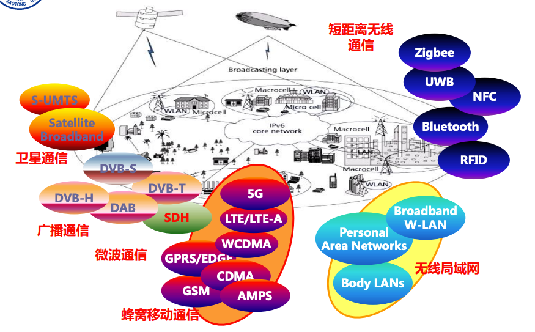

# 1. 无线通信概论

## 1.1 无线通信技术与频谱

无线通信是利用电磁波可以在空间中传播的特性，进行信息交换的一种通信方式。

无线通信传输的是信息，而不是能量。

电磁波在无线通信中充当载体，信息可以加载到电磁波的幅度上、相位上等。

电磁波包含很广，比如电波、红外线等。无线通信主要关注300MHz到300GNz之间的频段。

不同频段的电磁波的传播特性不同，适宜的应用也不同。

无线电频谱资源有限，且无线信道传输是开放的，容易相互干扰，因此绝大多数频率都是授权使用的。

### 常见无线频段：毫米波

毫米波：一般将26.5GHz到300GHz之间成为毫米波频段

特点：

- 可用频谱很宽（资源多）
- 波长短，可实现射频器械小型化
- 传播损耗快，传输距离短，器件成本高

## 1.2 无线通信发展史

电生磁 -> 法拉第 磁生电 -> 麦克斯韦 麦克斯韦方程组 -> 赫兹 第一幅无线天线 -> 无线电报

1948年 香农信息论+香农三定理（可变长无失真信源编码定理、有噪声信道编码定理、保失真度准则下的有失真信源编码定理）

### 蜂窝移动通信系统

> 也就是常说的1G、2G、5G、...

蜂窝移动通信系统中，把通信服务区划分为若干小的无线覆盖区（小区），通常表示为六角蜂窝状。

每个小区设置一个基站，负责小区内移动台通信和控制。

基站间通过核心网相连，一般相邻小区不能使用相同频率，不相邻的小区则可以复用。

特点：

- 双向通信
- 支持切换和漫游

#### 第一代移动通信（1G）

AMPS：第一代蜂窝移动通信系统

模拟通信，只能承载语音信息

#### 第二代移动通信（2G）

GSM：最广泛的2G系统

特点：

- 数字通信
- 容量大
- 终端价格低
- 业务支持单一，不能支持宽带数据服务

#### 第三代移动通信系统（3G）

有4个国际标准：

- WCDMA（中国联通）
- CDMA2000（中国电信）
- TD-SCDMA（中国移动）
- WiMAX

特点：

- 扩频、码分多址
- 承载多媒体业务
- 容量更大

#### 第四代移动通信系统（4G）

LTE计划，采用了OFDM、MIMO等一批技术，大幅度提升了数据传输速率。

LTE包括LTE FDD和TD-LTE两种。

特点：

- 峰值速率高
- 网络结构扁平化，全IP组网
- 网络部署灵活，支持多种带宽
- 网络时延小

#### 第五代移动通信系统（5G）

三大应用场景：

- 增强移动宽带（快）
- 海量机器类通信（大规模物联网）
- 超高可靠低延迟通信

## 1.3 常用无线通信系统

### 卫星通信

利用人造卫星作为中继站，转发无线电波实现两个或多个地球站之间的通信。

特点：

- 通信距离远，覆盖范围大
- 不熟地理条件限制
- 安全可靠，可作为应急通信
- 传输时延大，收到太阳黑子影响

### 微波通信系统

用微博作为载波，进行信息传输的无线通信方式。

特点：

- 抗干扰能力强
- 保密性好
- 组网灵活
- 对于地面远距离通信，需要采用“中继”传输

> 已逐渐被光纤通信取代，主要应用于特殊场景，比如山区、海岛

### 无线局域网（WLAN）

计算机网络与无线通信技术相结合的产物

特点：

- 传输速率高
- 免授权频段
- 兼容性好
- 小型化
- 易于部署

### 短距离无线通信系统

- IR（红外）
- RFID（射频识别）
- Bluetooth
- Zigbee
- UWB
- NFC
- Ad hoc

### 无线广播/电视通信系统

特点：

- 成本低，覆盖范围大
- 单向传输

## 1.4 无线通信面临的挑战

- 更高的传输速率要求
- 频谱资源稀缺
- 恶劣的传播环境
- 网络建设成本增加，业务收入增长缓慢
- 节能与环保

### 无线通信的目标

- 高速率
- 高可靠
- 易部署
- 节能与环保