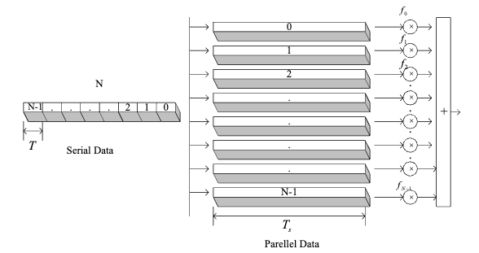
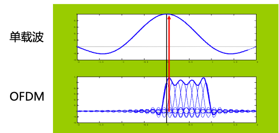
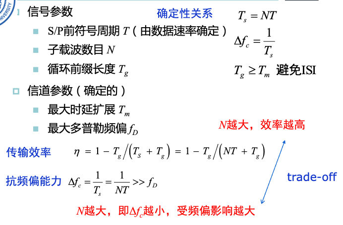
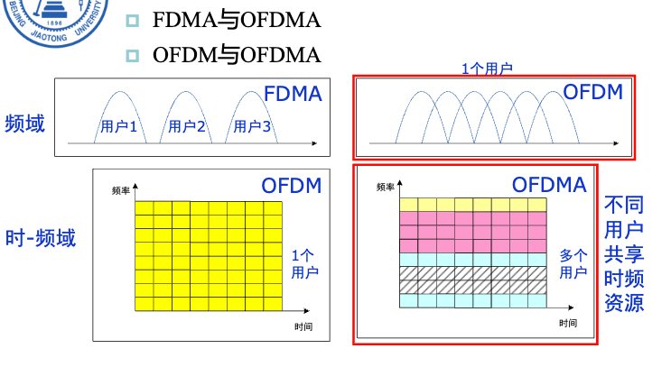

# 10. 正交频分复用

## 10.1 系统模型

正交频分复用（Orthogonal Frequency-Division Multiplexing，OFDM）：

- 发射端：通过串/并变换，将高速数据流分成多个并行低速子数据流，用多个正交子载波并行传输。
- 接收端：分离各子载波，分别接收

> 子载波只要相互正交，即使重叠，相互间也没有干扰。
>
> 两个子载波的频率间隔满足$\Delta f = \frac{1}{T_s}$就能够正交。
>
> $T_s$为符号持续时间

技术优点：

- 抗ISI能力强：每个符号持续时间很长

缺点：

- 对频偏更加敏感
  - 每个子载波带宽减小，较小的频偏就会导致较大的子载波间干扰（ICI）
  - 造成频偏的原因：
    - 发射机和接收机的本振间存在频率差
    - 多普勒频移

- 峰均功率比（Peak-to-Average Power Ratio，PAPR）高，浪费功率放大模块的性能

## 10.2 数字实现

最开始，OFDM的实现需要许多硬件支持，因此成本极高。后来出现了数字实现，才开始普及民用。

## 10.3 抗多径

通过串并变换，使得符号持续时间大于时延扩展，使得OFDM系统的抗ISI能力增强。

通过加入保护间隔，能够更进一步阻断ISI。

> 加入保护间隔显然会带来一定的效率损失

原始的保护间隔的设计是在保护间隔中，信号保持0，但是这样会破坏子载波之间的正交性（增大ICI）。因此有人提出，在保护区间内使用循环前缀（Cyclic Prefix，CP）。

## 10.4 基本参数设置

## 10.5 正交频分多址（OFDMA）于高效资源管理

OFDMA技术特点：

- 可以根据用户业务需求，灵活配置频率和时间资源
- 在频率选择性衰落信道中，可以优化子载波分配，尽可能让每个用户使用信道特性好的子载波

基于OFDM还可以实现自适应OFDM传输：

- 假设每个用户分配到的发射功率是一定的，我们就可以吧有限的信号能量集中到“较好的”子载波上
  - 这样“较好”的子载波就能够使用高阶调制，携带更多信息
