# 11. 多天线技术

## 11.1 概述与信道容量

### 多输入多输出（MIMO）

多输入多输出（Multiple-Input Multiple-Output，MIMO）是在发射端和接收端使用多个天线，使信号能够通过多个天线发射和接收。

假定发射天线间和接收天线间距离足够远，收发各天线间形成了独立信道（不相关信道），此时可以在不增加频率和发射功率情况下，极大地提高传输速率和可靠性。

### 系统模型

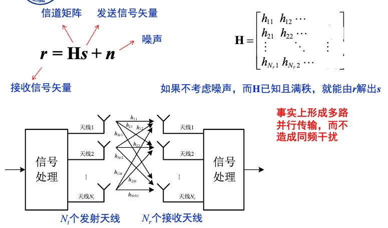

### 信道容量

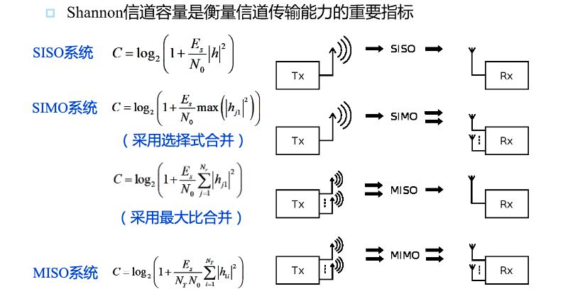

> SISO：单输入单输出
> SIMO：单输入多输出
> MISO：多输入单输出

### 非衰落MIMO信道容量

> 假定信道没有衰落，此时MIMO系统的信道容量

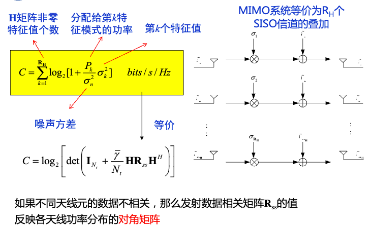

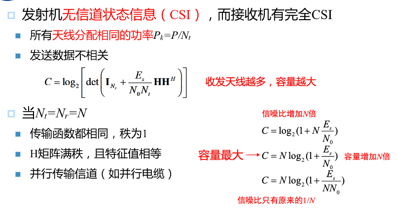

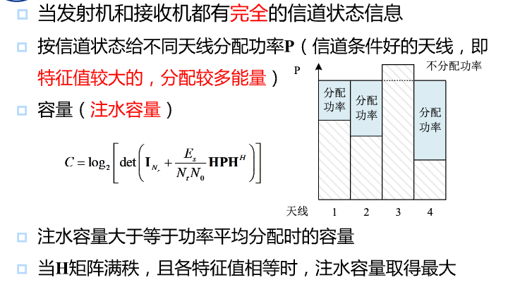

### 平坦衰落信道的容量

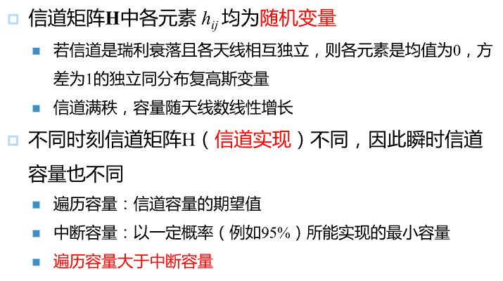

### 影响信道容量的因素

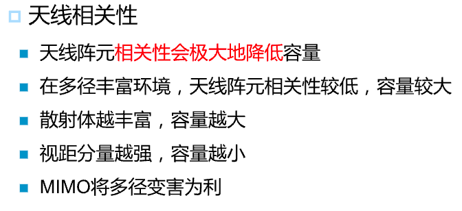

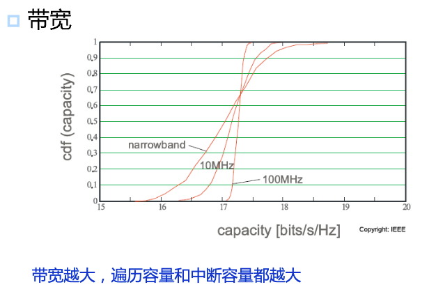

## 11.2 波束赋形

> 波束赋形一般是在发射端采用多天线，接收端采用单天线

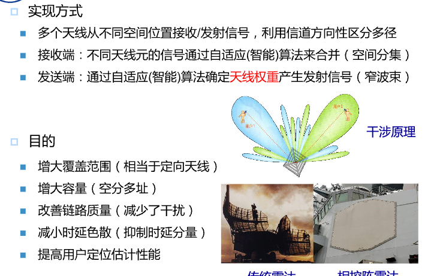

### 天线权重的调整算法

#### 时间参考法

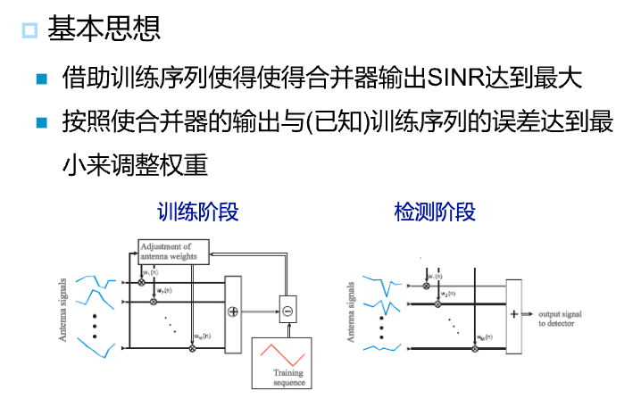

#### 空间参考法

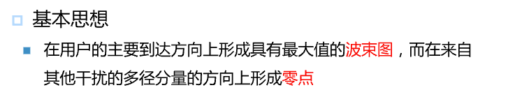

#### 盲算法

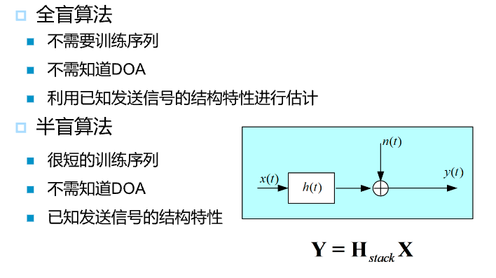

