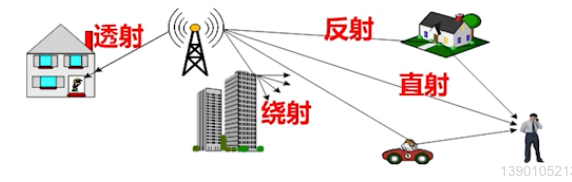
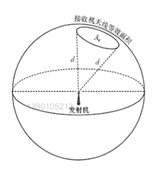
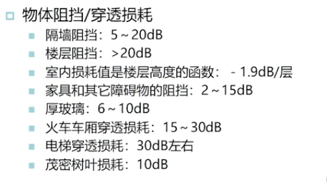
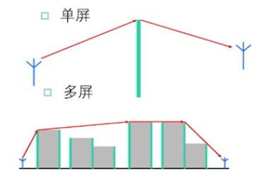
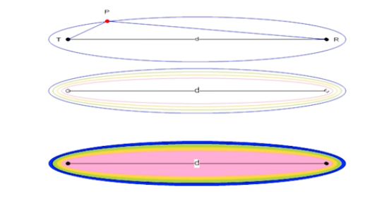
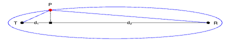
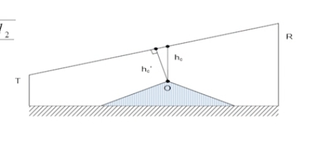
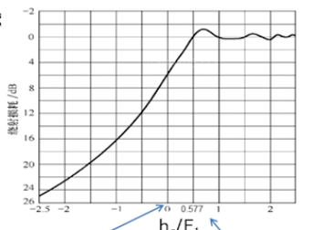
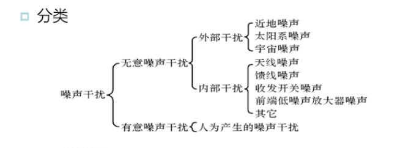
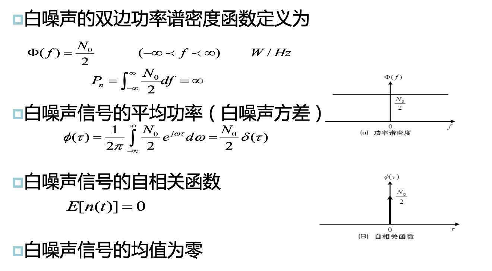

# 2. 无线电传播机制

## 2.1 电波传播机制与直射传播

### 电波直射传播

- 直射：电磁波直接传播到接收机
- 反射与透射：照射到比在波波长大的平面物体时，一部分反射，一部分透射
- 绕射：照射到物体的不规则表面的边缘

### 发射功率与接收功率

发射信号:$s(t) = Re\{u(t)e^{j2\pi f_c t}\}$

接收信号:$r(t) = Re\{v(t)e^{j2\pi f_c t}\} + n(t)$

> 直射条件下，接收信号就是发射信号经过一定的路径损耗，再叠加一定的噪声得到的。

对应的我们有:

- 发射功率:$P_{TX} = \lim\limits_{T\rightarrow \infty}\int_{-\frac{T}{2}}^{\frac{T}{2}}s^2(t)dt$
- 接收功率:$P_{TX} = \lim\limits_{T\rightarrow \infty}\int_{-\frac{T}{2}}^{\frac{T}{2}}r^2(t)dt$

> 功率一般定义为信号的平方在一个周期上的积分

发射功率和接收功率之间的联系：

- 天线会对信号有增益作用
  - 增益效果：$G = \frac{A_{eff}}{A_{ISO}} = \frac{4\pi}{\lambda^2}A_{eff}$
  - $A_{eff}$为天线有效接收面积
  - $A_{ISO}$为全向天线接收面积，为$A_{ISO} = \frac{\lambda^2}{4\pi}$
- 全向有效辐射功率：无线通信接收机收到的信号不仅与发射机天线的输入功率有关，还与发射机天线增益有关：$P_{EIRP} = P_{TX}G_{TX}$
  
> 全向有效辐射功率是指信号经过发射天线，最后实际的发射功率

### 自由空间损耗

自由空间损耗联系发射功率和接收功率：

$P_{RX}(d) = P_{TX}G_{TX}G_{RX}(\frac{\lambda}{4\pi d})^2$

> Friis' law

> 相同距离下，频率越高，波长越短，功率损耗越大

Friis' law适用于：

- 天线远场
  - 收发天线的距离远大于波长，远大于天线尺寸
  - 收发天线的距离至少要间隔一个瑞利距离$d_R = \frac{2L_a^2}{\lambda}$
- 自由空间损耗
- 均匀介质

> $L_a$为天线直径

> Friis's law只适用于直射场景

## 2.2 反射与透射

定义：

- 发射：发射机发射的电磁波，照射到比载波波长要大的平面物体反射出来的电磁波再被无线通信接收机的天线接收
- 透射：空中的电磁波照射到某一物体时，一部分能量的信号会经反射、绕射或散射后再空气中出那波，另一部分能量的信号会直接穿透物体，在该物体的背面空气中传播

应用：

- 短波通信（反射）
- 室内接收（透射）

透射和反射现象是有公示可以计算对应现象的衰减的，但是由于计算过于复杂，因此实际分析时我们一般直接根据环境进行近似：

在简单场景，即存在一个直射路径和一个反射路径时，发射功率和接收功率可以通过$d^{-4}$定律计算：

$$
P_{RX}(d) = P_{TX}G_{TX}G_{RX}(\frac{h_{TX}h_{RX}}{d^2})^2
$$

> 即此时功率随距离的4次方衰弱

> $h_{RX}$为接收天线的高度

再考虑更一般的情况，即环境中存在大量多径，此时我们一般用断电模型进行计算：

$$
P_{RX}(d) = P_{RX}(d_{break})(\frac{d}{d_{break}})^{-n} \ \ \ d > d_{break}
$$

> $P_{RX}(d_{break})$指在断点处的接收信号功率

> $n$是一个与环境有关的常数

## 2.3 绕射与散射

### 绕射

定义：无线通信发射机发射的电磁波照射到物体的不规则突出表面的边缘，再传播到无线通信接收机的天线处

> 遵循惠更斯(Huygen)原理

#### 菲涅尔环带

**菲涅尔椭球面**：由所有到收发天线距离的和相等的点组成的椭球面

我们把到收发天线距离的和等于收发天线距离加半波长的点构成的椭球面称为第一菲涅尔区:$PT + PR = d+ \frac{\lambda}{2}$。

同理有第n菲涅尔区：$PT + PR = d+ n\times \frac{\lambda}{2}$。

**菲涅尔区半径**：从菲涅尔球面上的一点到TR的垂直距离：

**余隙**：障碍物顶端到T、R连线的垂直距离

**相对余隙**：余隙比第一菲涅尔区半径

> 横坐标为相对余隙，纵坐标为路径损耗

#### 多屏绕射

> 以上基于菲涅尔区的计算方法只适用于只存在单个障碍物的场景

计算多屏绕射的方法有很多：

- 布林顿(Bullington)方法：用等价单屏代多屏
- 易普斯丁-彼得森(Epstein-Petersen)方法：计算每一屏的绕射并叠加

### 散射

定义：发射机发射的电磁波，照射到比载波波长小的物体上，反射出多路不同的较弱的电磁波，再传播到无线通信接收机天线处。

> 一般散射比较弱，不予考虑

## 2.4 系统噪声与干扰

定义：无线通信信道中的噪声和干扰，是指信道中无意或有意产生随机性很强、影响无线通信接收机信号接收群确性的信号

### 噪声功率

一般用噪声功率衡量噪声的影响

**基础热噪声**：

- 室温下带宽为B时的噪声功率为：$-174+10lg(B) dBm$

> 带宽为200KHz，室温下，接收机前端无源器件的热噪声功率为:$-121dBm$，即输出信号为0时，输出的噪声水平。

**射频前端噪声**：

- 通过噪声系数计算
  - 噪声系数为:$噪声系数 = \frac{输入信噪比}{输出信噪比}$
  - 射频前端噪声为:$射频前度噪声 = 噪声系数 + 噪声系数 $

一般我们的通信系统由多层部件组成，此时级联部件的复合噪声系数为：

$$
F_{eq} = F_1 + \frac{F_2 - 1}{G_1} + \frac{F_3 - 1}{G_1G_2} + \cdots
$$

> 一般只考虑一二级

### 噪声特性

一般认为噪声为高斯白噪声（AWGN）

> 非白噪声称为有效噪声

### 信噪比SNR

一般用信噪比评估噪声对系统的影响：

$$
SNR = \frac{P_{RX}}{N} = \frac{E_sR_s}{N_0 B}
$$

## 2.5 系统链路预算

衰落余量：无线系统所面对的是空间和时间均在变化的传输信道。即使距离不变，接收功率也可能随着时间或移动而变化，计算得到的接收功率只是平均值，因此必须追加衰落余量保证在所有的情况中至少有$90\% $以上的情况是复合最小接收功率的。

> 不考虑衰落余量，系统的终端概率就是$50\% $

有效各向同性辐射功率（EIRP）：发射功率+天线增益

链路断点模型：在断点之前用Friis' law计算路径损耗，在断点之后用断点模型计算路径损耗。

