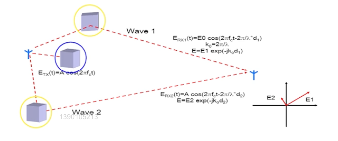
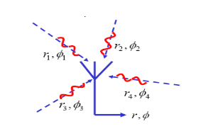
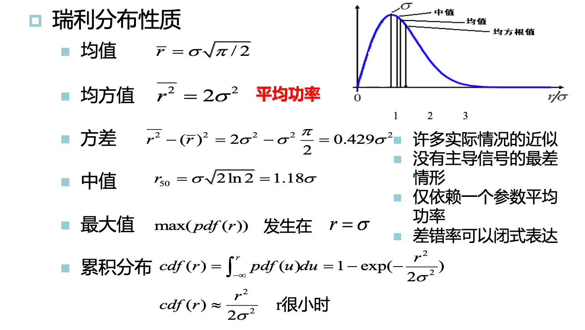
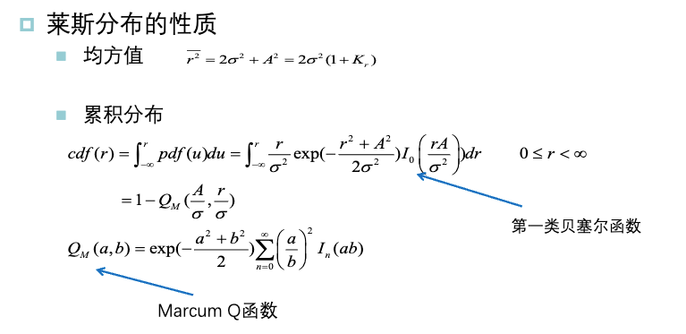
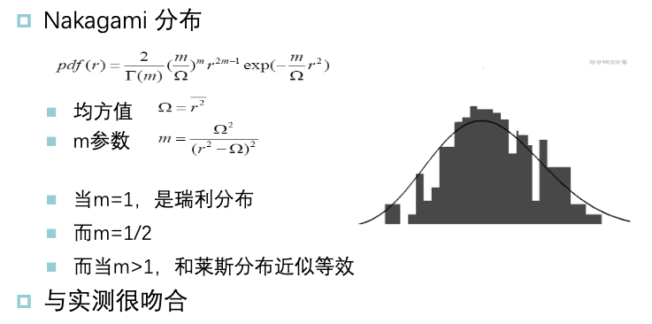
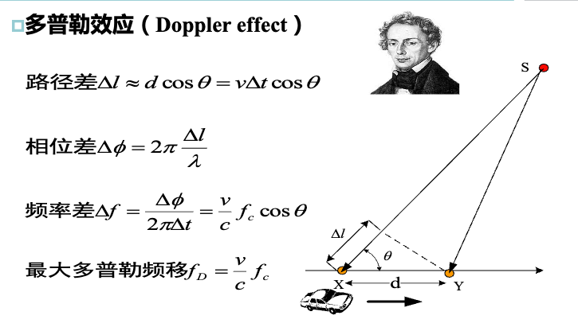
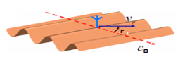
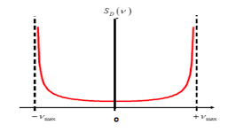
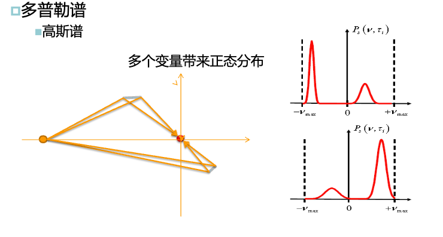
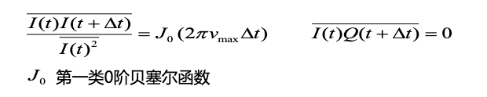

# 3. 窄带无线信道

## 3.1 概述与大尺度衰落

- 大尺度衰落/阴影衰落：波动发生在大约几百个波长范围内——地形障碍物
  - 衰落慢
- 小尺度衰落：波动发生在大约一个波长范围内——多径+移动
  - 衰落快

### 大尺度衰落/阴影衰落

满足对数正态分布，即大尺度衰落的取值取对数后满足正态分布。

> 一般大尺度衰落的对数正态分布的方差取值为$4\cdots 10 dB$

## 3.2 两径模型

> 两径模型是最简单的小尺度衰落模型

> 直射链路被遮挡，有两个光滑反射面

在时不变系统中，各径的时延不随时间变化，即同一地点幅度恒定。此时两条路径的长度差为半波长的奇数倍时，反相叠加，合成场强最弱；此时两条路径的长度差为半波长的偶数倍时，同相叠加，合成场强最弱。

在时变两径模型中，衰落间隔为半个波长，每秒深陷的数目以来移动速度。

## 3.3 不含主导分量的小尺度衰落

到达的多条路径的幅度近似。

不含主导分量的多径模型：

- 实部$Re(E)$和虚部$lm(E)$都是许多随机变量的和
- 实部和虚部服从均值为0的正态分布
- 实部和虚部相互独立
- 幅度$|E|$服从瑞利分布(Rayleigh)
- 相位服从均匀分布

## 3.4 含主导分量的小尺度衰落模型

含主导分量的多径模型：

- 实部$Re(E)$和虚部$lm(E)$都是许多随机变量的和
- 实部服从均值为A的正态分布，虚部服从均值为0的正态分布
- 实部和虚部相互独立
- 幅度$|E|$服从莱斯分布
- 相位服从非零均值的正态分布

莱斯分布：

- 莱斯因子$K = \frac{A^2}{2\sigma^2}$
  - K很大，正态分布
  - K很小，瑞利分布（近似于无主导分量的情况）

> 主导路径功率/其他路径的功率

> 在莱斯分布下，由于计算较为复杂，莱斯分布一般不利于计算，因此又推出了Nakagami分布

Nakagami分布：

> Nakagami分布与实测非常吻合

## 3.5 多普勒效应与衰落的时间依赖性

### 单径+移动

> 接收机以速度$v$同电磁波传播方向（频率为$f_c$）呈$\gamma$角移动

接收信号频率: $f = f_c + v$

其中多普勒频移: $v = -f_c \frac{V}{c_0}cos(\gamma)$

最大多普勒频移: $v_{max} = f_c\frac{v}{c_0}$

### 双径+移动

多径的每一个分量都会产生多普勒频移，双径的多普勒频移不同，他们的多普勒频移差会产生快衰落

### 多径+移动

多径时会产生多普勒谱。

#### 多普勒谱

U型谱：

- 二维平面，接收机位于散射区中央
- 没有视距
- 四周均匀到达的多径
- 到达天线的入射角均匀分布在$[0,2\pi)$

> 此时接收信号构成U型谱

高斯谱：

> 当多径不符合均匀分布时，出现高斯谱

### 衰落的时间相关性

叠加信号在不同时间上是存在相关性的：

> 实部相关，实部与虚部无关

衡量衰落速率的重要指标：

- 电平通过率（LCR）：1秒内通过门限电平$r$的平均次数
- 平均衰落时间（ADF）：平均包络低于门限电平$r$的平均持续时间

