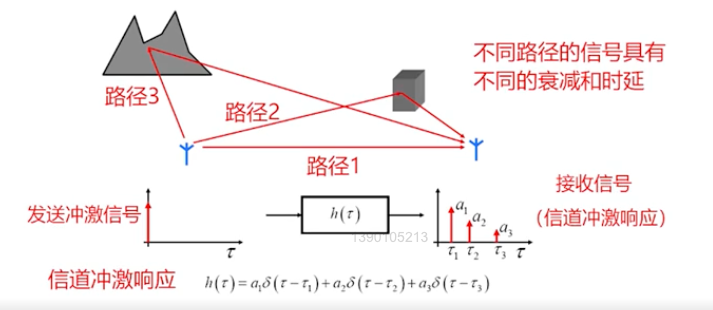
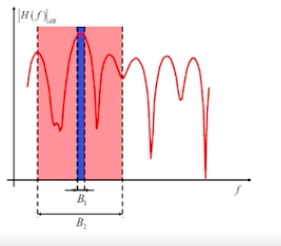
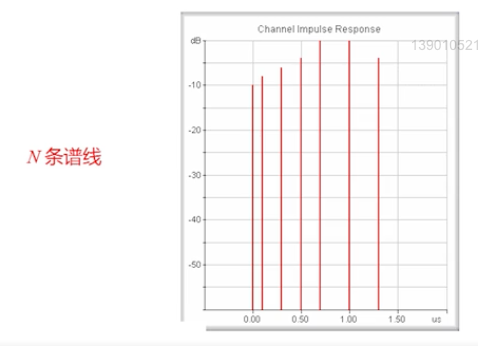
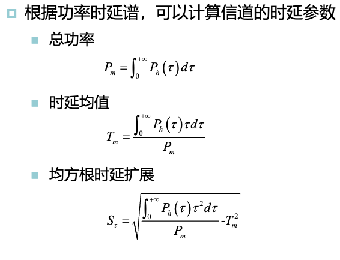
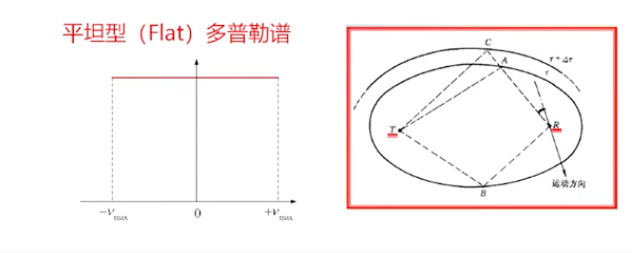
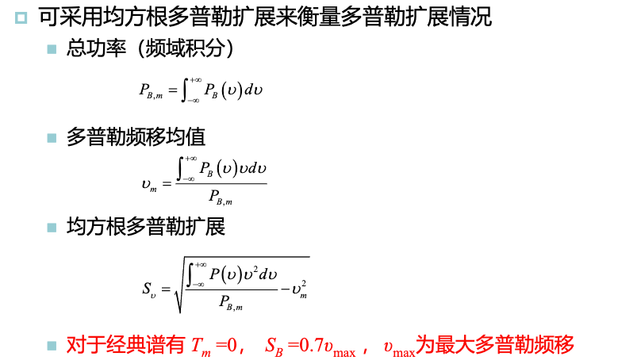
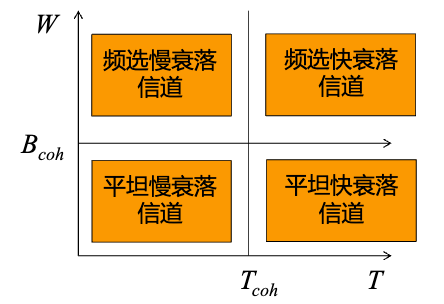

# 4. 宽带和方向性信道

## 4.1 多径时延扩展

当发送冲击信号（时域宽度为0，频域无限宽）而非单载波（频域宽度为0，时域无限宽）时，不同路径的接收信号在时域上能区分开：

在发射机、接收机和散射体不发生改变时，以发射机和接收机为椭圆圆心，可以画出无穷多个椭圆，处于同一椭圆面的散射体的多径信号具有相同的时延，称为**不可分辨多径**；对应的，处于不同椭球面的散射体的多径信号具有不同的时延，称为**可分辨多径**。

**时延扩展**：最大时延和最小时延的差值。

由于时延扩展的存在，接收信号中的一个码元的波形回扩展到其他码元周期中，引起**符号间干扰（ISI）**。通过**提高发射功率**的方式（提高信噪比），无法抑制ISI，因此形成了差错基底（error floor）。

对应的**增大码元周期**，使其远大于多径时延扩展$\Delta$，可以有效减少符号间干扰，但是这又会降低码元速率。

> 时延扩展可以理解为时域视角下，多径对信号的影响。

**宽带信号频率响应**：不同频率，由于时延差导致相位差不同，因此在某些频率上多径信号相长，某些频率上多径信号相消。

不同频率信道特征（响应）不同。（称之为**频率选择性衰落**）

**窄带信道**中频率响应基本保持不变为一个常数。

窄带信道可以认为是宽带信道在频域上的一个切片。

> 对应于时延扩展，宽带信号频率响应可以理解为频域视角下，多径对信号的影响。

多径对宽带信号的影响：

- 时域上时延扩展，符号间干扰
- 频域上信道频率选择性衰落，导致信号失真
- 同时**一定程度上减少了信号整体深衰落的可能性**（所有频率都深衰落）

**功率时延谱**：对各时延接收信号的功率的期望值所构成的谱，不考虑时间的相关性，是对多径信道的简化描述方式。可如下计算:

$$
P_h(\tau) = \lim\limits_{T\rightarrow \infty} \int^T_0 |h(t,\tau)|^2 dt
$$

> 其中$h(t,\tau)$是信道冲击响应

> 功率时延谱是反应的平均情况，而不是瞬时情况

> 实际情况中，常把功率时延谱离散化
>
> 

功率时延谱的一些性质：

**相干带宽**：将信道自相关系数小于一定阈值时的频率差定义为相干带宽。其值与均方根时延扩展成反比，是信道频率选择性衰落特性的度量。可如下计算:

$$
B_{coh} \approx \frac{1}{2\pi S_\tau}
$$

> $S_\tau$为均方根时延扩展

> 两频率分量之差小于相干带宽，认为衰落是相关的，反之是不相关的。

**两种衰落**：

- 非频率选择性衰落（**平坦衰落**）：各频率成分衰落程度基本一致
- 频率选择性衰落：不同频率衰落程度不同

> 那么什么时候发生平坦衰落，什么时候发生频率选择性衰落呢？

信号通过信道时，是经历平坦衰落还是频率选择性衰落，取决于信号带宽$W$和相干带宽$B_{coh}$：

- $W<B_{coh}$，经历平坦衰落
  - 频率上看，信号不同频率成分衰落成都一致，接收波形不失真
  - 从时域上看，时延扩展远小于符号持续时间，可认为无符号间干扰
- $W>B_{coh}$，经历频率选择性衰落
  - 频率上看，信号不同频率成分衰落不一致，接收信号波形发生失真
  - 从时域上看，时延扩展与符号持续时间相当，会造成严重的符号间干扰

随着带宽越来越大，频率选择性衰落问题越来越严重，主要解决方案：

- 均衡
- 分集
- 发端扩频，收端RAKE接收
- OFDM
- MIMO

## 4.2 多普勒扩展

**多普勒扩展**：在多径环境中，不同路径的电波，其入射角不尽相同，因此回又不同的多普勒频移。当多径复杂时，不同多普勒频移就称为占有一定宽度的**多普勒扩展**（又称**多普勒谱**）。

相干时间：相干时间可以用来表征信道衰落快慢，一般将信道自相关系数减小到0.5（0.3dB）的时间差定义为相干时间。

想拿时间与均方根多普勒扩展成反比，是信道随时间变化特性的度量。可如下计算:

$$
T_{coh} \approx \frac{1}{2\pi S_B}
$$

> 两时刻之差小于相干时间，认为衰落相关，大雨相干时间认为不相关

衰落的快慢取决于符号的持续时间$T$与信道的相干时间$T_{coh}$：

- $T>T_{coh}$，经历时间选择性衰落（快衰落，时变衰落），符号传输过程中信道状态发生明显变化
- $T<T_{coh}$，经历非时间选择性衰落（慢衰落，时不变衰落），符号传输过程中信道状态未发生明显变化

> 快衰落信道下，信道特征变化很快，导致信道估计准确性下降，造成接收性能的恶化

结合平坦、频率选择性、快、慢衰落，可得到如下的图：

> 对不同类型的信道，通信系统会采用不同的传输技术，也会有不同的性能

## 4.3 广义平稳非相关散射(WSSUS)

> 对无线信道进行简化的假设

### 广义平稳（WSS）假设

对具有相同时延的分量，信道冲击响应的自相关函数与变量$t$无关，只与时间差有关。即统计特性不随时间变化。

同理，如果他们有不同的多普勒频移，则经历的衰落也是不相关的。

> 注意区分不随时间变化和时变的区别

### 非相关散射（US）假设

对具有不同时延的分量，经历的衰落不相关（独立衰落）

频率上衰落与频率绝对值无关，只与频率差有关

同时满足WSS和US假设，则称为广义平稳非相关散射（WSSUS）模型

## 4.4 方向性信道

> 完全没听懂，西八

