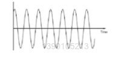
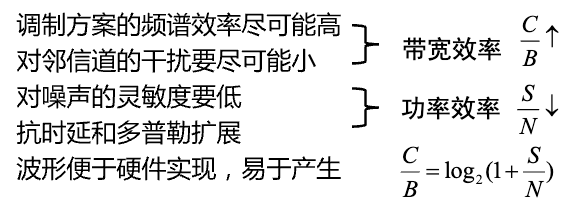

# 5. 数字调制解调

## 5.1 为什么要进行调制解调

为什么：

- 天线有效长度和波长有关，调制到更高的频率，可以减小天线尺寸
- 通过调制，将不同系统、不同用户的信号搬移到不同的频率上去，可以有效率用频率
- 通过频率搬移，可以便于躲避干扰
- 信号加载到高频上去，这个过程就是发射端的调制，在接收端将信号从高频上卸载下来就是解调

### 调制基本分类

载波信号可以简单表达为如下形式：

$$
s(t) = \mathop{A}\limits_{幅度} cos(2\pi \mathop{f_c}\limits_{频率} + \mathop{\varphi}\limits_{相位})
$$

> 根据载波信号的关键成分，自然衍生出三种调制方案，即将信号调制到幅度、频率和相位上

**基带信号**：原始需发送的信号（分为模拟信号和数字信号）

**调制方案**：

- 模拟调制
  - 幅度调制(AM)
  - 频率调制(FM)
  - 相位调制(PM)
- 数字调制
  - 幅移键控(ASK)
  - 频移键控(FSK)
  - 相移键控(PSK)
  - 组合、正交幅度调制(QAM)

### 如何选择调制方式

选择调制方式时应遵循的准则：

无线通信常用调制方式：

- 线型调制：BPSK、QPSK、$\pi$/4-DQPSK、OQPSK、MQAM
- 非线形调制：2FSK、CPFSK、MSK、GMSK

