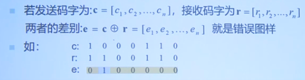
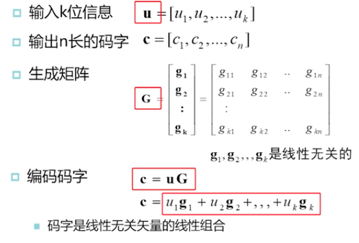
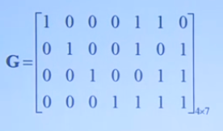
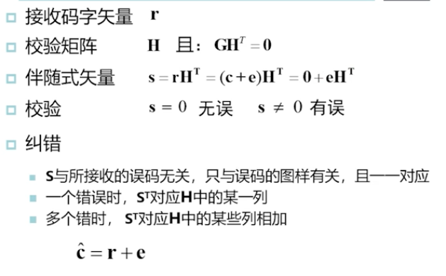
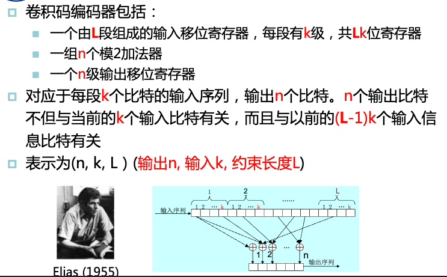
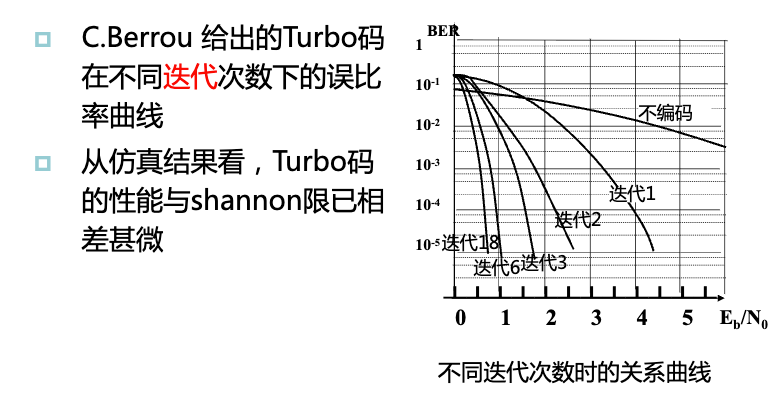
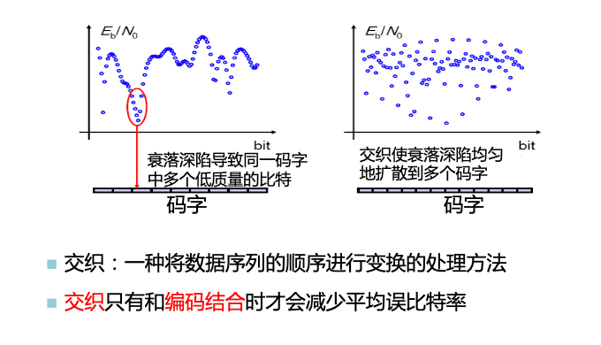

# 6. 信道编码

## 6.1 为什么要进行信道编码

信道编码是为了提高信道传输的可靠性，改善系统的通信质量。

1948年，香农给出了有噪声信道编码定律：只要$R<C$，通过信道编码就可以到达任意小的误码率。

> $R$:传输码率 
> $C$:信道容量

### 信道编码的实质

信道编码的实质就是根据一定的规律在待发送的信息码元中人为地加入一定的多余码元（称为监督码），以引入最小的多余度为代价来换取最好的抗干扰性能。

## 6.2 线形分组码

分组码：信息序列以每$k$个码元分组，每组$k$个信息按一定规律产生$r$个监督码元，输出序列每组长为$n=k+r$，每一个码字的$r$个监督元只与本码字的$k$个信息位有关，通常记分组码为$(n,k)$。

线性码：信息码元与监督码元之间呈线性关系，他们的关系可能用一组线形代数方程组联系起来。

线形分组码：信息码元与监督码元之间呈线形关系的分组码。

- 码长：码字的长度
- 码率：$Rc = \frac{k}{n}$
- 码重：码字中非零元素的个数
- 汉明距离：码字间相同位置元素不同的个数
- 最小汉明距离：所有汉明距离中的最小者
- 错误图样：查错的形式也可以用二元序列来描述
  - 

线形分组码编码范式：

> 生成矩阵是编码设计者设计得到的

Hanmming编码的生成矩阵：

线形分组码如何译码：

> 校验矩阵是和生成矩阵对应的

**汉明码**是能够纠所有单个错误的完备码。

码率一定的条件下，码长越长，性能越好。

**循环码**：一种线形分组码，各码字中的码元循环左移（或右移）所形成的码字仍然是码组中的一个码字（全零码除外）。

## 6.3 卷积码

## 6.4 Turbo码

## 6.4 LDPC码

## 6.5 衰落信道中的编码

