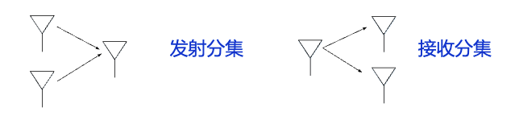
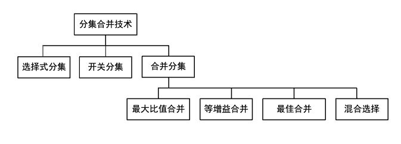

# 8. 分集

## 8.1 基本原理

问题：

- 多径和多普勒频移导致信道发生衰落
- 当处于深衰落时，系统性能发生严重恶化
- 单纯在用信道编码无法解决这一问题

原理：

- 信号经过两个或多个独立或高度不相关的分集支路到达接收机
- 接收机利用某种合并方式，对从多个分集支路接收到的信号副本进行合并
- 某个分集支路经历深衰落，但其他的分集支路可能未经历深衰落
- 从概率意义上讲，接收到的多个信号样本的功率同时低于门限，比任意单个信号功率低于门限的概率小的多
- 分集达到和抑制衰落，提高传输可靠性的目的

> 分集的相关性越小，分集的性能越好

## 8.2 微分集

> 频率差越大，分集相关性越小

### 空间分集

空间分集也称为天线分集，通常采用多个收发天线，是无线通信中广泛采用的分集形式

- 只要天线间距足够大，就可使各个天线接收到的信号相呼独立或高度不相关
- 保证相呼独立或高度不相关所需的最小天线艰巨，随传播环境和工作频率的不同而不同
- 一般而言，间隔几个波长就能实现相互独立或高度不相关
- 多径分量越丰富，所需的波长越小

空间分集又分：

- 发射分集：在发射端使用多根天线，信号经过发射机处理后通过多根天线发射出去
- 接收分集：在接收端使用多根天线，合理地合并各个接收天线接收到的信号

> 角度分集和极化分集可以认为空间分集的两个特例

### 时间分集

将承载相同信息的信号，在多个时刻上进行传输（利用信道时变衰落特性），只要时间间隔大于信道相干时间，不同时刻的信道可以认为相互独立或高度不相关。

实现时间分集的方法：

- 重复编码
- 自动重传请求
- 差错控制编码结合交织技术

时间分集的局限性：

- 时间分集会产生时延
- 对于慢衰落信道，需要很大的时间间隔
- 当移动终端静止不动，时间分集无法有效工作

缺点：

- 时间上引入冗余，频谱利用率收到损失

### 频率分集

将承载相同信息的信号，通过多个频率进行传输（利用信道频率选择性衰落特性）。只要频率间隔大于信道相干带宽，不同频率的信号可以认为相互独立或高度不相关。

实现频率分集的方法：

- 直接序列扩频技术
- 多载波-OFDM技术
- 带编码的跳频技术

局限性：

- 平坦衰落信道下，频率分集无效

缺点：

- 频域上引入冗余，降低了频率利用率

### 角度分集

信号在传播中，通常会经过多个不同路径，并以不同角度到达接收端

- 接收机利用多个具有不同方向图的接收天线分别接收不同方向来的信号
- 这些分量具有相互独立的衰落，从而达到分集的目的

### 极化分集

采用具有不同的极化（水平极化和垂直极化）的发射天线/接收天线

- 不同极化方向电磁波的反射系数不同，足够多的随机反射导致不同极化方向的信号传输相互独立或高度不相关
- 采用不同的极化方式，天线不用相隔很远就可以实现分集
- 极化分集可以认为是空间分集的特例

> 极化是指电磁波的震动方向，可以是水平的、垂直的或其他方向的

## 8.3 宏分集

> 微分集具有良好的抗小尺度衰落特点，但是无法应对阴影衰落

宏分集是一种减小阴影衰落的分集技术

- 把多个基站设置在不同的地理位置上和不同方向上，同时和小区内的一个移动台进行通信
- 只要各个基站的信号不是同时受到阴影衰落的影响，通过选择其中信号最好的一个基站进行通信，就能保持通信不中断
- 中继：中继器接收信号，进行转发（放大转发，译码后转发）也可以认为是宏分集的一种实现方式

## 8.4 信号的合并

### 选择式分集

监听所有支路，选择指示参量（RSSI、误比特率、...）最好的支路的信号

### 开关分集

开关分集只同时监控一个分集支路，当该支路的质量低于某一门限时，切换到其他支路

优点：

- 只需要监听一条支路，复杂度低

主要缺点：

- 不能保证新支路质量更好
- 可能会产生频繁的无效切换

### 最大比值合并

对各个分集上的信号加权合并

### 等增益合并

对$N$条相同支路信号进行同相位处理，等权重累加合并

## 8.5 分集增益

略