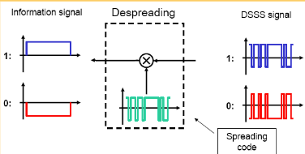

# 9. 扩展频谱通信

> 将信号扩展到比数据速率大得多带宽上进行传输

## 9.1 跳频

跳频：在单次通信中，载频在多个频率上跳变。

接收端和发射端持有相同的本地伪随机序列，只要双方频率跳变规律相同且同步，就可将接收到的跳频信号转换为固定频率的中频信号。

跳频分为：

- 慢跳频：跳频周期是符号周期的倍数
- 快跳频：跳频周期是符号周期的约数

技术特点：

- 抗干扰
- 躲避干扰
- 良好的兼容性
- 对远近效应不敏感
- 抗多径衰落（频率分集）

### 跳频多址

多址：许多用户组成的一个通信网，网中多个用户可以同时通信，共享资源

常用的多址技术：

- 频分多址（FDMA）
- 时分多址（TDMA）
- 码分多址（CDMA）

此外还有跳频多址：不同用户使用不同的跳频图案

## 9.2 直接序列扩频和码分多址

### 直接序列扩频（DSSS）

直接将窄带信号的带宽扩展。

扩频增益：相对于未扩频信号，带宽增加了多少倍。

技术特点：

- 抗多径
- 抗截获
- 保密性好

#### 直接序列码分多址（DS-CDMA）

不同用户采用不同的扩频序列。接收机只能解扩期望信号，而其他用户的信号因扩频序列不同，无法解扩，类似噪声。

> 简单的说，就是将原始信号与扩频序列相乘（原始信号为窄带，扩频序列是一个人为设计的宽带信号，相乘后得到新的宽带信号）
>
> 

每个用户看似占用频率很宽，但是是共享的不是独享的。

DS-CDMA可以同频组网：相邻的小区可以使用相同的频率，即频率复用因子为1，从而进一步提升频率利用率。

CDMA系统的三个核心点：

- 软容量（soft capacity）：

  - CDMA系统中用户次啊用的扩频序列并非完全正交，因此用户之间仍存在一定的干扰
  - 随着用户数量的增加，通信质量逐渐变坏，系统容量是以干扰程度来衡量的

- 话音激活：人的话音是不连续的，根据统计，激活期通常只有$35\%$左右，CDMA系统可以实现话音激活技术，有话音才发射信号，没有话音就停止发射，那么在话音停顿时，所有其他通信中的用户都会因干扰减少而受益。

- 软切换：用户从一个小区切换到另一个小区，用户与原基站和新基站都保持通信链路，只有当移动台在新的小区建立稳定通信后，才断开与原基站的通信链路

直接序列码分多址（DS-CDMA）缺点：

- 远近效应：距离基站较劲的用户，到达基站处的信号较强，会干扰基站接收记录较远的信号的接收
  - 序列自动功率控制，自动调节各用户的发射功率，使到达基站处各用户的信号功率基本相等

## 9.3 扩频序列

扩频序列对CDMA系统的性能至关重要。

扩频序列需要具有的特点：

- 良好的自相关：类似冲击信号
- 良好的互相关值：互相关值始终较小

## 9.4 跳时脉冲无线电

> 通过直接序列扩频得到带宽5000MHz及以上的宽带信号的实现难度较大

脉冲无线电通过发送窄脉冲（将用户所需的信息包含在脉冲的位置和幅度中），可以低成本实现扩频。主要用户超宽带（UWB）通信系统中。

