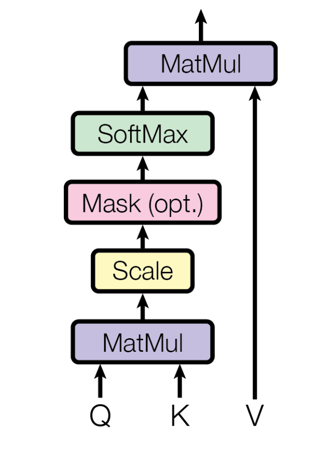
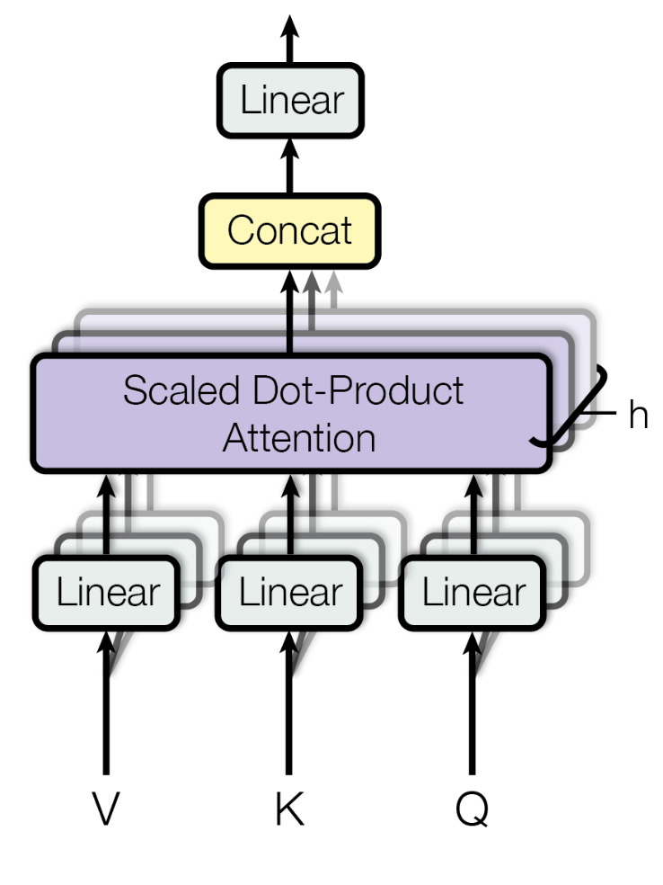

# 注意力机制

注意力机制是神经网络中对长序列内元素之间相互影响的建模方法，比如NLP中的文本。关键思想是在上下文向量和输入之间构建映射，以允许模型处理不同的部分。

> 注意力机制的本质是什么，Q、K、V非别是什么含义？

## 论文里怎么说

> 以下是对`Attention Is All You Need`论文的部分翻译+自己的理解。

注意力机制可以被描述为将一个query和一组key-value对映射到一个输出的函数。其中query、keys、values和output都是向量。output以values的加权和的方式被计算。其中权重是又一个计算query和相应的key的兼容性的函数所确定的。

### Scaled Dot Product Attention

缩放点积注意力。输入由维度为$d_k$的query和key与维度为$d_v$的value组成。我们计算query与每一个key的点乘，然后除以$\sqrt{d_k}$，最后经过softmax函数得到value的权重。

在实际操作时，我们会同时对一个集合的query进行注意力操作，此时我们会讲多个query打包为一个矩阵$Q$，key和value也会打包为矩阵$K$和$V$，此时公式为：

$$
Attention(Q,K,V) = softmax(\frac{QK^T}{\sqrt{d_k}})V
$$

两个最常用的注意力机制是加性注意力和点积注意力，在论文`Attention Is All You Need`中，作者基于点积注意力提出了缩放点积注意力，主要区别就是引入了$\frac{1}{\sqrt{d_k}}$。

## Multi-Head Attention

多头注意力。我们发现将query、key和value进行$h$次可学习的线形映射，将他们映射到$d_k$、$d_k$和$d_v$维度，然后再进行注意力操作，比直接使用单个注意力函数更有效。

对于每组映射得到的query、key和value，我们会并行的计算注意力，然后将结果拼接起来，最后通过一个线性层将其投影到$d_v$维度。

多头注意力允许模型共同关注来自不同位置的不同表征子空间的信息。

$$
MultiHead(Q,K,V) = Concat(head_1, ..., head_h)W^O\\
head_i = Attention(QW_i^Q,KW_i^K,VW_i^V)
$$

## 参考

- [Attention Is All You Need](https://arxiv.org/abs/1706.03762v7)
- [注意力机制的本质|Self-Attention|Transformer|QKV矩阵](https://www.bilibili.com/video/BV1dt4y1J7ov/?share_source=copy_web&vd_source=c675206b339487e9755eec554de241a9)
- [64 注意力机制【动手学深度学习v2】](https://www.bilibili.com/video/BV1264y1i7R1/?spm_id_from=333.999.0.0&vd_source=beb3167a2d3c9e837f79ea5fb8a5c155)
- [paper with code](https://paperswithcode.com/methods/category/attention-mechanisms-1)