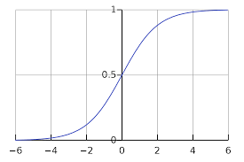
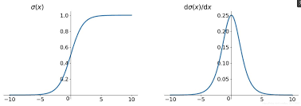

# Logistic回归

> 文章逻辑:
> 1. 描述分类任务
> 2. 假设样本分布后使用最大似然法解决二分类任务
> 3. 归纳得到朴素的分类模型
> 4. 基于朴素的分类模型推广得到`Logistic`回归模型
> 5. 探讨`Logistic`回归的影响

## 首先我们描述一下分类任务

在分类任务(无论是二分类还是多分类)中, 我们在构建自己方法和模型时, 我们的任务往往可以抽象为如下三部分:

- 找到一个分类函数集合

对于二分类任务, 我们希望这个函数能够满足如下性质:

$$
f(x): x => \begin{cases}
    g(x) > mask & output = class 1\\\\
    else & output = class 2
\end{cases}
$$

> 我们想找到一个函数$g(x)$, 在它输出的值大`mask`时, 我们就将`x`分类为`class 1`, 否则我们就讲它分类为`class 2`.

- 找到一个损失函数
- 通过某个方法找到在函数集合中能让损失函数最小的那个函数, 或者说优化分类函数

## 考虑一个二分类任务

假设我们构建一模型, 来将输入分类为`class 1`或`class 2`.

### 找到一个分类函数集合

基于朴素的概率学, 我们如下定义我们的分类函数集合:

$$
g(x) = P(C_1|x) = \frac{P(x|C_1) P(C_1)}{P(x|C_1) P(C_1) + P(x|C_2) P(C_2)}
$$

$$
f(x): x => \begin{cases}
    g(x) > 0.5 & output = class 1\\\\
    else & output = class 2
\end{cases}
$$

> $C_1$是指当前输入属于`class 1`这一事件
>
> $C_2$是指当前输入属于`class 2`这一事件
>
> 其中$P(C_1)$和$P(C_2)$为先验概率, 即对应类别在数据集中的占比.

> 模型中的未知量有: $P(x|C_1)$和$P(x|C_2)$

这是一个很符合直觉的模型, $P(C_1|x)$这一条件概率的物理含义为: 在我们接收到的输入为`x`时, 我们将其归类为`class 1`的概率. 由于这是一个二分类问题, 显然有$P(C_2|x) = 1 - P(C_1|x)$.

我们希望我们的模型能够在`x`真实属于`class 1`时, $P(C_1|x)$能够尽量的高; 而在`x`真实属于`class 2`时, $P(C_2|x)$能够尽量的高.

### 引入高斯分布

为了方便讨论, 我们不妨假设我们的样本符合某一个分布, 然后我们就可以进一步的计算我们的模型——我们在这里假设我们的样本符合高斯分布(Gaussian Distribution), 即我们的样本的分布律符合以下公式:

$$
f_{\mu, \sigma}(x) = \frac{1}{(2\pi)^{D/2}} \frac{1}{|\sigma|^{1/2}} exp
\{-\frac{1}{2} (x - \mu)^T \sigma^{-1} (x-\mu)\}
$$

> 这是符合高斯分布的随机向量的概率分布函数

现在我们知道了样本的分布律. 那么, 从朴素的概率学出发, 我们可以使用最大似然法来拟合我们的模型. 

### 引入最大似然法

在知道模型的分布律的情况下, 我们能够得到如下的似然函数:

$$
L(\mu, \sigma) = f_{\mu, \sigma}(x_1) f_{\mu, \sigma}(x_2)...f_{\mu, \sigma}(x_n)
$$

> 似然函数的含义: 在已知分布律, 并给定均值和方差$\mu, \sigma$的情况下, 我们经过`n`次采样得到手头的数据集($x_1, x_2, ..., x_n$)的概率有多大. 

最大似然法的逻辑就是找到一组$\mu, \sigma$, 让似然函数的取值最大, 然后我们就把这组$\mu, \sigma$当作真实分布的均值和方差, 或者说: 如果一个分布函数能够让我们最可能得到目前的数据集, 那我们就认为这个分布函数就是真实的分布函数. 用数学的语言复述一遍:

$$
\mu^*, \sigma^* = \mathop{\arg\max}\limits_{\mu, \sigma} L(\mu, \sigma)
$$

根据期望和方差的定义, 我们可以得到$\mu^*$和$\sigma^*$的通式:

$$
\mu^* = \frac{1}{n} \sum\limits_{i=1}^{n} x_i
$$

$$
\sigma^* = \frac{1}{n} \sum\limits_{i=1}^{n} (x_i - \mu^*)(x_i - \mu^*)^T
$$

> 强调一下, 以上通式, 是在我们假定了样本分布符合高斯分布的情况下推出来的, 不能够被推广.

> 这里的最大似然法直接替代了我们在[描述分类任务时](#首先我们描述一下分类任务)`找损失函数`和`优化分类函数`的两步.

### 得到朴素的分类模型

在引入了高斯分布和最大似然法后, 我们的朴素分类模型就完成了:

- 首先, 我们找到了一个分类函数集合:

$$
g(x) = P(C_1|x) = \frac{P(x|C_1) P(C_1)}{P(x|C_1) P(C_1) + P(x|C_2) P(C_2)}
$$
$$
f(x): x => \begin{cases}
    g(x) > 0.5 & output = class 1\\\\
    else & output = class 2
\end{cases}
$$

> 其中$P(C_1)$和$P(C_2)$为先验概率, 即对应类别在数据集中的占比.

- 然后通过最大似然发找到最优的分类函数(替代了找损失函数, 然后再优化分步骤)

通过最大似然法我们可以得到$P(x|C_1)$和$P(x|C_2)$的值分别为$f_{\mu_1, \sigma_1}(x)$和$f_{\mu_2, \sigma_2}(x)$, 此时函数已经被确定, 或者说我们的模型完工了.

> 对没错, 这里有两个分布律, 两组不同的$\mu, \sigma$. 
>
> 属于不同类别的样本, 理应有不同的分布律.

在分类时, 我们将样本`x`输入`f(x)`函数, 然后就能够得到样本所属的类别.

### 调整朴素的分类模型

在实际使用的过程中, 我们往往会让不同类别的样本分布律共用一个$\sigma$.

> 此时$P(x|C_1)$和$P(x|C_2)$的值分别为$f_{\mu_1, \sigma}(x)$和$f_{\mu_2, \sigma}(x)$.

> 李宏毅并没有细说为什么

此时, $\sigma$可以通过以下方程计算得到:

$$
\sigma = \frac{1}{n} \sigma_1 + \frac{1}{n} \sigma_2
$$

> 数据集中, 属于`class 1`的样本有`n`个, 属于`class 2`的样本有`m`个.

## 进一步思考

### 观察分类函数

$$
g(x) = P(C_1|x) = \frac{P(x|C_1) P(C_1)}{P(x|C_1) P(C_1) + P(x|C_2) P(C_2)}
$$

> 分类函数虽然是指$f(x)$, 但是本质上我们是在求$g(x)$, 所以这里我们可能模糊了分类函数的概念. 如果你比较迷惑, 那我告诉你, 我们现在是在观察$g(x)$.

$g(x)$经过简单运算, 可转化为如下形式:

$$
g(x) = P(C_1|x) = \frac{1}{1 + \frac{P(x|C_2)P(C_2)}{P(x|C_1)P(C_1)}}
$$

此时如果我们令$z = ln \frac{P(x|C_2)P(C_2)}{P(x|C_1)P(C_1)}$, 那么$g(x)$就可以化简为如下形式:

$$
g(x) = \frac{1}{1 + exp(-z)}
$$

> 没错! `sigmoid`函数出现了!!!

此时, 对于`z`, 我们将高斯分布的分布函数带入$z = ln \frac{P(x|C_2)P(C_2)}{P(x|C_1)P(C_1)}$中, 差不多是这样的形式:

$$
\begin{align}
& z = ln \frac{f_{\mu_1, \sigma}(x) P(C_1)}{f_{\mu_2, \sigma}(x) P(C_2)}\\\\
& \Rightarrow z = ln \frac{f_{\mu_1, \sigma}(x)}{f_{\mu_2, \sigma}(x)} + ln \frac{P(C_1)}{P(C_2)}\\\\
& \Rightarrow z = ln \frac{f_{\mu_1, \sigma}(x)}{f_{\mu_2, \sigma}(x)} + ln \frac{\frac{N_1}{N_1 + N_2}}{\frac{N_2}{N_1 + N_2}}\\\\
& \Rightarrow z = ln \frac{f_{\mu_1, \sigma}(x)}{f_{\mu_2, \sigma}(x)} + ln \frac{N_1}{N_2}
\end{align}
$$

> 其中$N_1$和$N_2$分别代表两类样本的总量.

然后, 我们可以将高斯分布的分布函数拆开, 也就是将$f_{\mu, \sigma}(x) = \frac{1}{(2\pi)^{D/2}} \frac{1}{|\sigma|^{1/2}} exp
\{-\frac{1}{2} (x - \mu)^T \sigma^{-1} (x-\mu)\}$带入$z$中:

$$
z = \begin{matrix} \underbrace{ (\mu_1 - \mu_2)^T \sigma^{-1} } \\ w \end{matrix} x  + \begin{matrix} \underbrace{ - \frac{1}{2} \mu_1^T \sigma_1^{-1} \mu_1 + \frac{1}{2} \mu_2^T \sigma_2^{-1} \mu_2 + ln \frac{N_1}{N_2} } \\ b \end{matrix} 
$$

> $\sigma = \sigma_1 = \sigma_2$

这里比较跳跃, 你可能会对我们如何将高斯分布的分布函数带入, 然后化简得到以上公式比较迷惑. 如果你想搞清楚, 可以参考[李宏毅2023机器学习的视频](https://www.bilibili.com/video/BV1NX4y1r7nP?p=10&vd_source=beb3167a2d3c9e837f79ea5fb8a5c155), 在这个视频的`1:05:00`你会看到你想要的.

如上式所示, 如果我们将公式的两部分分别替换为$w$和$b$, 那么我们就将$z$变成了$z = wx+b$, 这样我们就可以将一个复杂的公式简化为了一个简单的线性方程.

> 观察$w$和$b$替换的部分, 可以看出来, $w$和$b$都是由$(\mu_1, \mu_2, \sigma, \sigma_1, \sigma_2)$组合计算得来的.

这个时候, 我们就会有一个朴素的想法, 比起求$(\mu_1, \mu_2, \sigma, \sigma_1, \sigma_2)$, 然后再计算出$w$和$b$, 最终得到模型; 我们能不能直接去拟合$w$和$b$呢? 显然是可以的!!!

### 归纳总结(得到`Logistic`回归模型)

经过以上推理, 我们将模型变成了如下形式:

$$
\begin{align}
g(x) = sigmiod(z) = \frac{1}{1 + e^{-z}}\\\\
z = wx + b\\\\
f(x): x => \begin{cases}
    g(x) > 0.5 & output = class 1\\\\
    else & output = class 2
\end{cases}
\end{align}
$$

> 这就是`Logistic`回归模型

此时我们只需要通过数据集回归拟合出$w$和$b$, 我们就能够得出最终的模型.

#### 将$z$化为$z = wx+b$会带来什么呢?

在上面的推论中, 我们是假定了高斯分布才最终将$z$归纳为$z=wx+b$的形式. 但是, 如果你假设样本是别的分布, 你最后也会得到一个类似的结果(也能将$z$归纳为$z=wx+b$). 所以我们令$z = wx+b$之后, 实际上是推广了我们的模型, 我们不再假设样本的分布, 从而得到了一个适用于所有分布的模型!

#### 关于损失函数

`Logistic`回归有一个需要注意的点是:`Logistic`回归不能使用均方误差作为损失函数, 需要使用交叉熵作为损失函数!

如果我们使用均方误差会怎样呢? 

模型的局方误差:

$$
L(f) = \frac{1}{2}\sum\limits_{n} (f_{w,b}(x^n) - \hat{y}^n)^2
$$

求偏导:

$$
\frac{\partial(f_{w,b}(x) - \hat{y})^2}{\partial w_i} = 2(f_{w,b}(x) - \hat{y})f_{w,b}(x)(1-f_{w,b}(x))x_i
$$

此处再给出`sigmoid`函数的图像:

观察偏导和`sigmoid`函数图像, 我们会发现:

当$\hat{y}^n = 1$时:

- 如果此时$f_{w,b}(x^n) = 1$, 则说明此时模型已经达到最优, 此时由于偏导为零, 模型不会进一步更新;
- 如果此时$f_{w,b}(x^n) = 0$, 则说明此时模型距离优化目标很远, 此时模型理应继续更新, 但是此时由于偏导数也为零, 因此此时模型反而也不会更新.

综上, 如果`Logistic`模型使用均方误差为损失函数, 那么如果我们在初始化权重时距离优化目标较远, 那么我们的模型将无法被进一步优化, 所以我们认为`Logistic`模型不能使用均方误差作为损失函数.