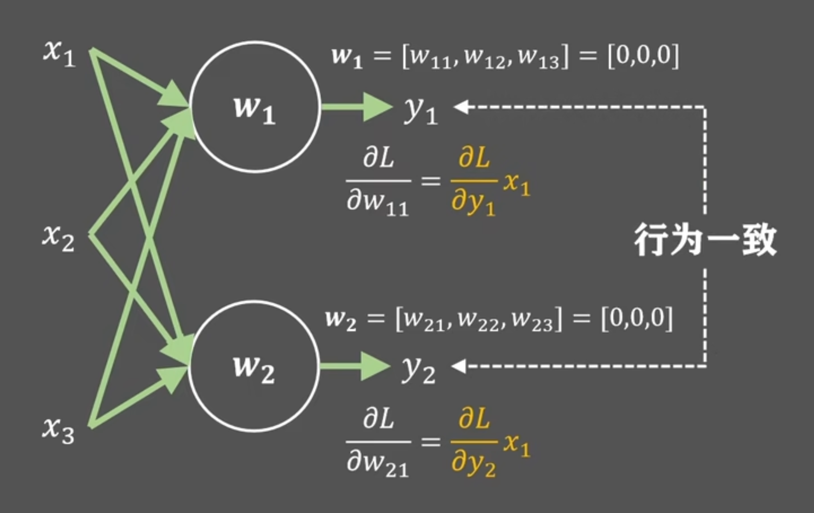
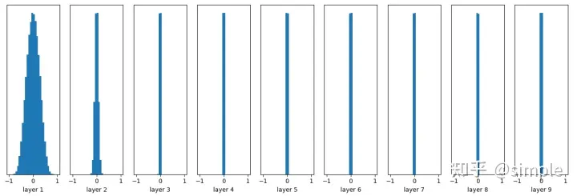
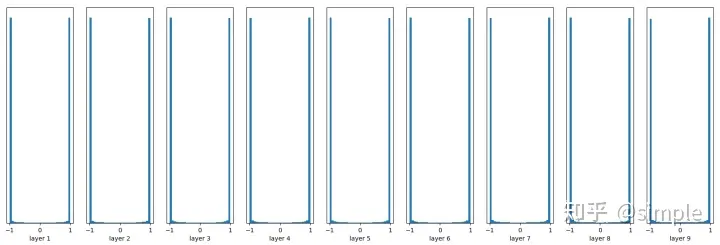

# 初始化基础知识

深度学习的过程就是依据一定的规则对模型的参数进行更新，而在更新开始之前，需要对参数进行初始化，给参数的搜索一个合适的起点。

最常见的错误想法是直接将所有权重初始化为0或随机初始化，虽然这个做法在凸优化中似乎可行，但是深度学习中，我们常常会将多个凸/非凸函数堆叠组合，形成一个非凸函数，此时如果将所有权重初始化为0或随机值，则会导致模型的性能不稳定，甚至难以收敛。

## 常见错误方案：0初始化

> 更一般的，不只是0，将所有的可学习参数初始化为一个统一的特定值都会导致反向传播失效。
>
> 他们的原因是一样的，我们方便讨论，只聊0初始化。

先说结论：如果把所有可学习参数都初始化为0或者一个统一的特定值，那么每一层的不同神经元学到的东西都是一样的（输出也是一样的），因为他们每次计算得到的梯度都是相等的。这会极大降低模型的学习能力（因为效果上等效于将每层只有一个神经元）。

原因：误差是根据权重的值进行反向传播的。如果初识时所有的参数都是一个值，那么在第一次前向传播计算loss时，每层网络内的不同的神经元的输出都是相等的，这会进一步导致在计算梯度时，每层网络内部的不同神经元的梯度值也相同，也就是说无论此时一层神经网络中有多少神经元，都等效于只有一个神经元。（虽然AlexNet告诉我们网络深度很重要，但是每层只有一个神经元的情况下，无论多深，模型的效果肯定也是差强人意）

## 随机初始化

随机初始化简单的说就是通过正态分布采样得到参数的初始值，每个参数采样一次。显而易见的，一旦随机分布选择不当，就会导致网络优化陷入困境。以下我们举例说明一下随机分布不当导致的问题：

我们以多层感知积为例，我们先假设每一层参数都是通过$N(0,0.0001)$的正态分布分布采样得到的，此时我们尝试绘制每层网络输出值的直方图会得到：

可以看到，从第三层开始，网络的输出都基本集中在0附近了。此时我们在反向传播计算梯度时，显而易见的会出现梯度消失的问题。

我们再以$N(0, 1)$的正太分布为例，此时我们尝试绘制每层网络输出值的直方图：

> 每层之间使用`sigmoid`作为激活函数

可以看到，每层的输出都集中到了`-1`或`1`处，出现了梯度爆炸问题。

## 解决方案

常用的解决方案有：

- [Xavier初始化](./xavier)
- [He初始化/Kaiming初始化](./kaiming.md)
- [Dirac delta初始化](./Dirac%20delta.md)

> 以上三种方案在Pytorch中均有对应实现。

## 参考

- [Why doesn't backpropagation work when you initialize the weights the same value?](https://stats.stackexchange.com/questions/45087/why-doesnt-backpropagation-work-when-you-initialize-the-weights-the-same-value)
- [浅谈深度学习初始化参数（weight initialization）](https://blog.csdn.net/z_feng12489/article/details/102856968)
- [参数初始化](https://www.bilibili.com/video/BV1r94y1Q7eG/?spm_id_from=333.337.search-card.all.click&vd_source=beb3167a2d3c9e837f79ea5fb8a5c155)
- [参数初始化 再硬核一点！](https://www.bilibili.com/video/BV1PF411K7nb/?spm_id_from=333.788&vd_source=beb3167a2d3c9e837f79ea5fb8a5c155)