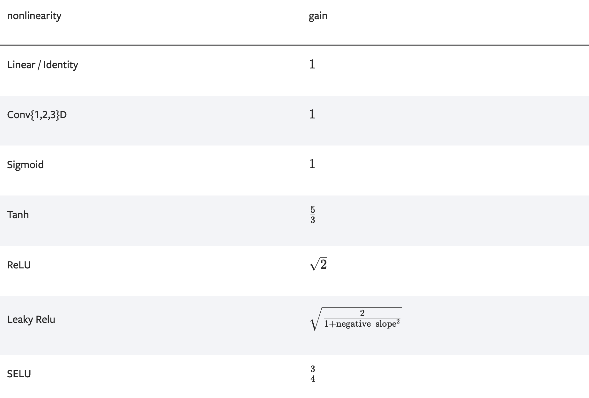

# 增益值

## 是什么？

增益值是指张量的数据输入到激活函数之后标准差的变化。



图中数据来自[pytorch官方文档](https://pytorch.org/docs/stable/nn.init.html)

我们以`Tanh`为例，对于均值为0，标准差为1的数据而言，经过激活函数`Tanh`之后，标准差会变为原标准差的$\frac{3}{5}$。此时对经过激活函数后的数据进行增益变化（乘上增益系数）就可以使当前模型和激活函数连续作用后的输出张量元素服从一个比较合理的数值，即$\frac{3}{5} \times \frac{5}{3} = 1$。

通过增益值，能够一定程度上降低模型梯度爆炸或消失的风险。

## 怎么用？

在一些参数初始化方案中可能会用到增益值。例如，`kaiming_uniform_`函数中会用到`calculate_gain`函数来计算增益值。

demo:

```python
nn.init.xavier_uniform_(m, gain=nn.init.calculate_gain('relu'))
```

> 在我浏览Github中别人的代码时，发现大多数人在使用xavier或kaiming初始化函数时，都没有传入参数gain，但是模型仍然能够正常收敛。由此我产生了一个疑问：这是否说明通过calculate_gain函数指定gain参数是一种最佳实践，但是并不是非他不可？
>
> 在编写本文时，我通过www.discuss.pytorch.org提出了疑问，蹲一波回复。[具体的提问网址](https://discuss.pytorch.org/t/what-is-gain-value-in-nn-init-calculate-gain-nonlinearity-param-none-and-how-to-use-these-gain-number-and-why/28131/9)

## 参考

- [pytorch文档](https://pytorch.org/docs/stable/nn.init.html)
- [csdn帖子](https://blog.csdn.net/seek0226/article/details/108901556)
- [What is gain value in nn.init.calculate_gain(nonlinearity, param=None) and how to use these gain number and why?](https://discuss.pytorch.org/t/what-is-gain-value-in-nn-init-calculate-gain-nonlinearity-param-none-and-how-to-use-these-gain-number-and-why/28131)
